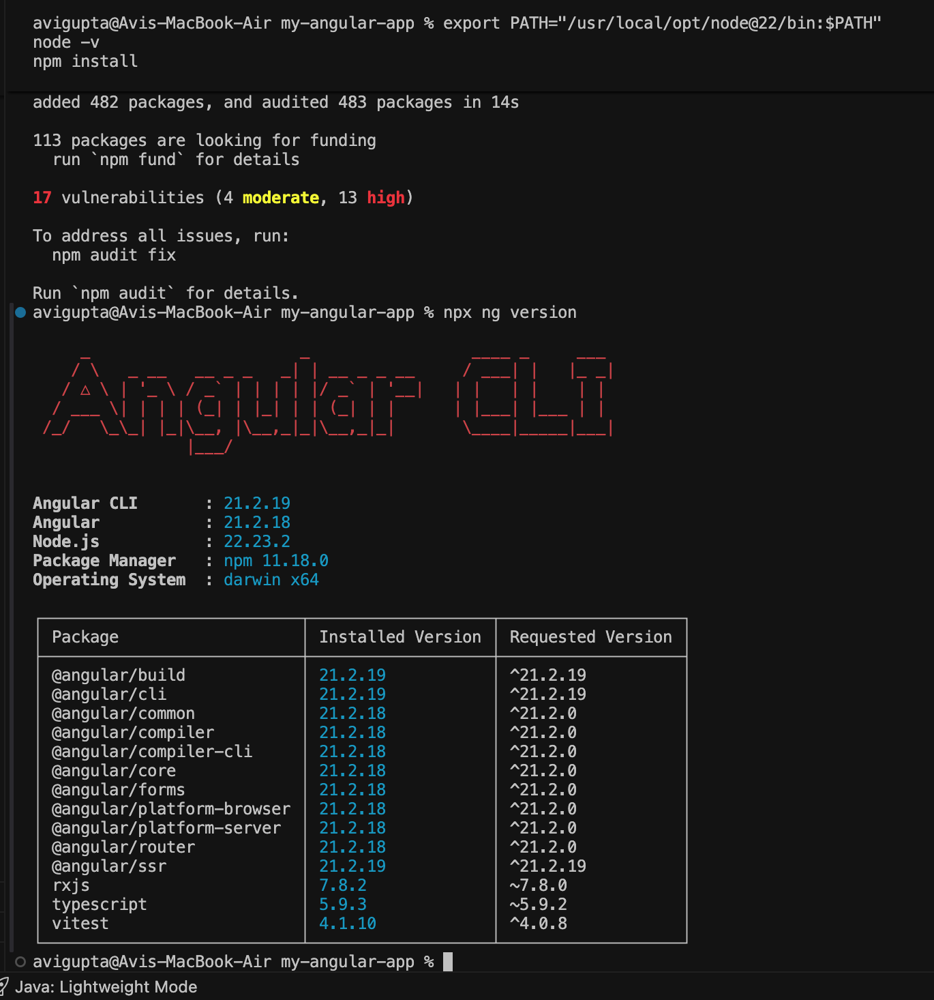
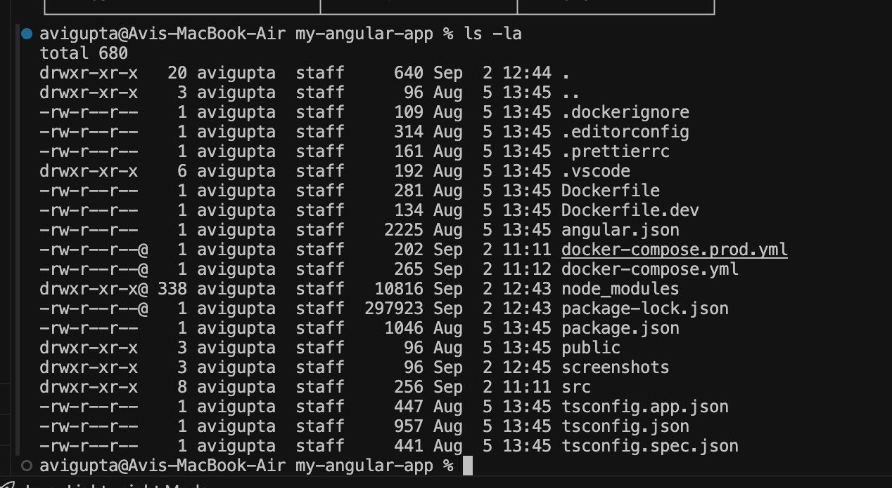
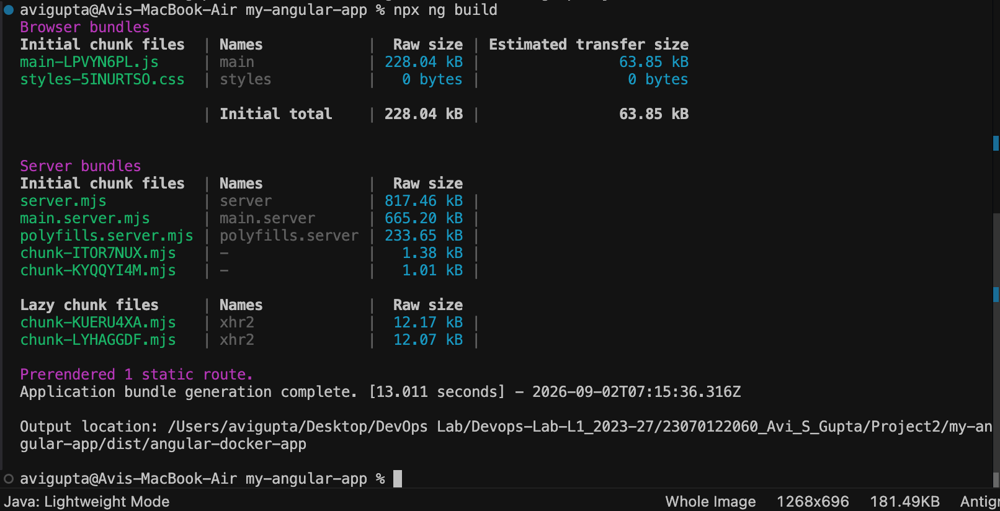
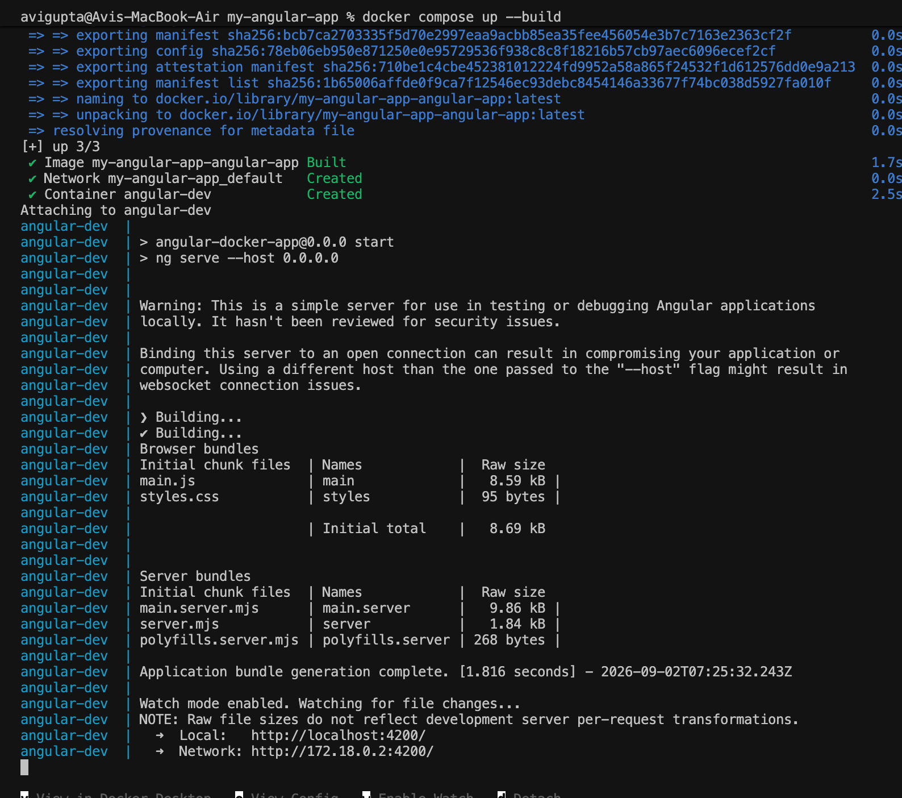
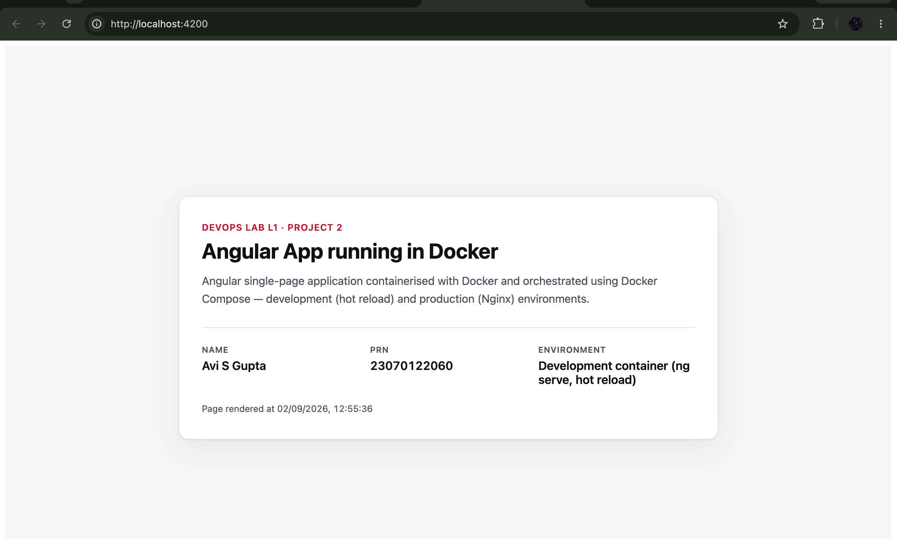
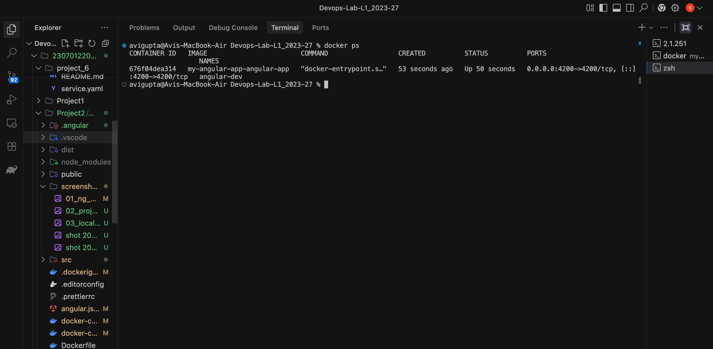
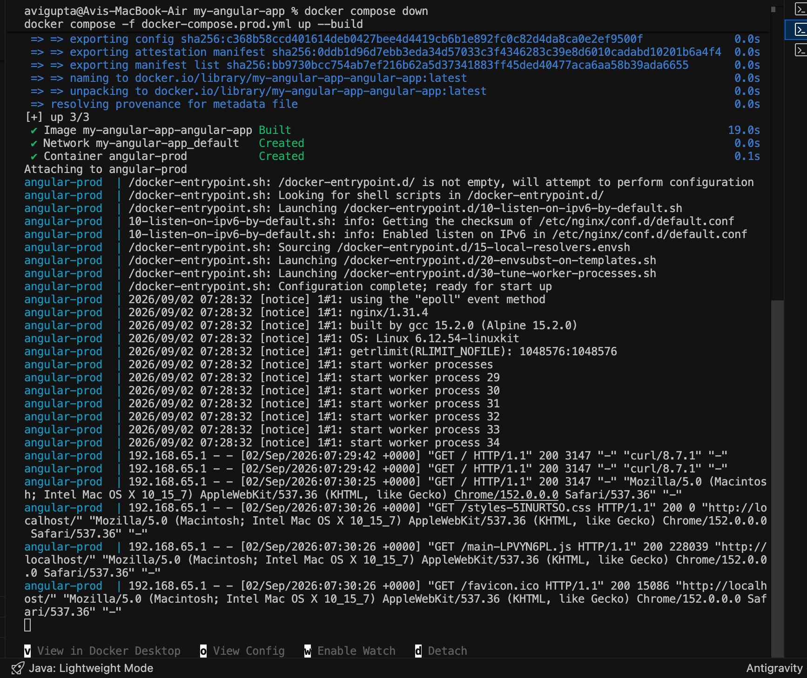
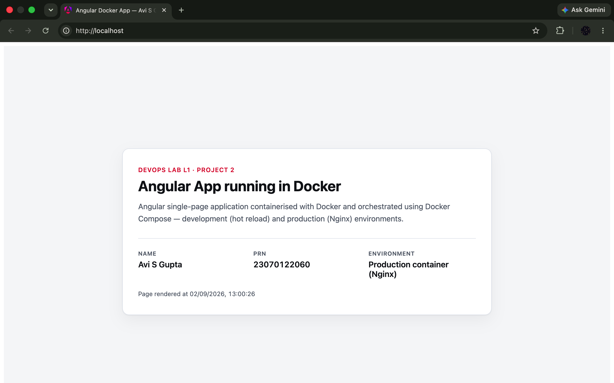
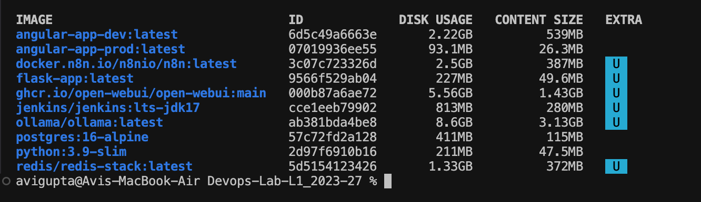
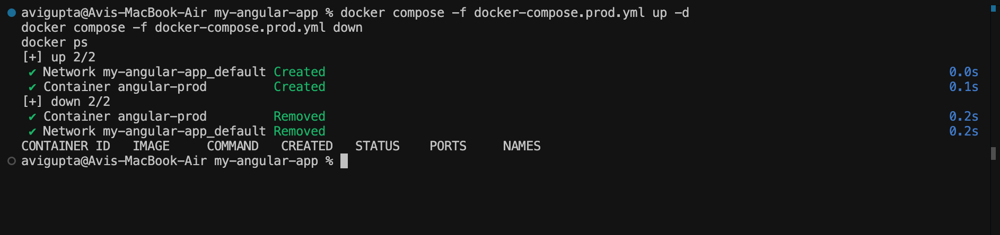

# Project 2 — Deploying an Angular Application with Docker Compose

## Student Details
- **Name:** Avi S Gupta
- **PRN:** 23070122060
- **Course:** DevOps Lab L1 (2023–27)
- **Executed on:** 02 September 2026, macOS (Apple Silicon, Darwin 25.5.0)

## Objective
To containerise a single Angular application **two different ways** using Docker Compose, and
to demonstrate why both are needed:

1. A **development** container that runs the Angular dev server (`ng serve`) with the source
   code bind-mounted from the host, giving hot reload while writing code.
2. A **production** container built with a **multi-stage Dockerfile**, where Node compiles the
   application and is then discarded, leaving only the compiled static assets served by Nginx.

The measurable outcome of the project is the size difference between the two resulting images.

## Tools & Technologies
| Tool | Role | Version |
|---|---|---|
| **Angular** | Front-end framework (the application) | 21.2.18 |
| **Angular CLI** | `ng serve` / `ng build` | 21.2.19 |
| **TypeScript** | Application language, compiled to JS | 5.9.3 |
| **Node.js** | Runtime for the Angular build tools | 22.23.2 (host) / 20 (container) |
| **npm** | Dependency installation | 11.18.0 |
| **Docker** | Container engine | 29.1.3 |
| **Docker Compose** | Multi-environment orchestration | v5.0.0-desktop.1 |
| **Nginx** | Serves the compiled assets in production | 1.31.4 (Alpine 15.2.0) |

## Architecture — the two environments

```
                        SAME ANGULAR SOURCE (src/)
                                    │
              ┌─────────────────────┴─────────────────────┐
              │                                           │
      docker-compose.yml                    docker-compose.prod.yml
      Dockerfile.dev                        Dockerfile (multi-stage)
              │                                           │
              ▼                                           ▼
┌──────────────────────────────┐      ┌─────────────────────────────────────┐
│  angular-dev                 │      │  STAGE 1  (build) — DISCARDED       │
│  ─────────────────────────── │      │  FROM node:20 AS build              │
│  FROM node:20                │      │  npm install                        │
│  npm install                 │      │  npm run build  →  dist/            │
│  ng serve --host 0.0.0.0     │      └──────────────┬──────────────────────┘
│                              │                     │ COPY --from=build
│  volumes:                    │                     ▼
│    .:/app          ←── host  │      ┌─────────────────────────────────────┐
│    /app/node_modules         │      │  STAGE 2  (kept) — angular-prod     │
│                              │      │  FROM nginx:alpine                  │
│  http://localhost:4200       │      │  /usr/share/nginx/html              │
│  Angular compiler stays      │      │  no Node, no node_modules, no .ts   │
│  resident → hot reload       │      │  http://localhost  (port 80)        │
└──────────────────────────────┘      └─────────────────────────────────────┘
        2.22 GB image                            93.1 MB image
```

## Key Concepts

**Multi-stage build.** The production `Dockerfile` has two `FROM` instructions. The second one
starts from a clean `nginx:alpine` base, which discards everything built in stage 1. Only the
directory named in `COPY --from=build` survives:

```dockerfile
FROM node:20 AS build
RUN npm run build                       # → /app/dist/angular-docker-app/browser

FROM nginx:alpine                       # ← everything above is dropped here
COPY --from=build /app/dist/angular-docker-app/browser /usr/share/nginx/html
```

Browsers cannot execute TypeScript, so once `ng build` has produced plain HTML/CSS/JS the Node
toolchain has no further purpose at runtime. Shipping it would only add size and attack surface.

**Bind mount for hot reload.** The development compose file maps the host directory into the
container, so the dev server compiles the *live* project folder rather than a frozen copy:

```yaml
volumes:
  - .:/app                # host source → container
  - /app/node_modules     # anonymous volume shields the container's own dependencies
```

The second line matters: without it the host's `node_modules` would shadow the container's,
which breaks on architecture mismatches (the host installed x86_64 binaries under Rosetta,
while the container is `linux/aarch64`).

**Layer caching.** In both Dockerfiles `package*.json` is copied and `npm install` is run
*before* the application source is copied. Editing a component therefore invalidates only the
final `COPY . .` and `npm run build` layers, so a rebuild costs ~12 s instead of re-installing
482 packages. This is visible as `CACHED` markers in the build logs of steps 4 and 7.

**Separate image tags.** Both compose files originally built to the same default image name,
meaning the production build silently overwrote the development image and made the sizes
impossible to compare. Each service now declares an explicit tag — `angular-app-dev` and
`angular-app-prod` — so both coexist (step 9).

## Project Structure
```
my-angular-app/
├── src/
│   ├── app/
│   │   ├── app.ts               # component: labels the environment by port
│   │   ├── app.html             # page showing name, PRN, environment
│   │   └── app.css
│   └── index.html
├── Dockerfile                   # production, multi-stage (node → nginx)
├── Dockerfile.dev               # development, single stage (node + ng serve)
├── docker-compose.yml           # dev environment      → localhost:4200
├── docker-compose.prod.yml      # prod environment     → localhost:80
├── .dockerignore                # excludes node_modules, dist, screenshots
├── angular.json                 # includes serve.allowedHosts (see step 4)
├── package.json
└── screenshots/
```

The application page reads its own port at runtime and reports
`Development container (ng serve, hot reload)` on 4200 versus
`Production container (Nginx)` on 80, so a screenshot alone identifies which container served it.

## Commands Used
| Command | Purpose |
|---|---|
| `npx ng version` | Verify the Angular / Node toolchain |
| `npx ng build` | Compile the application locally |
| `docker compose up --build` | Build and start the development container |
| `docker compose -f docker-compose.prod.yml up --build` | Build and start the production container |
| `docker ps` | List running containers |
| `docker images` | Compare image sizes |
| `docker compose -f docker-compose.prod.yml down` | Remove containers and networks |

---

## Procedure

### Step 1 — Verify the toolchain
Ran `npx ng version` to confirm Angular CLI 21.2.19 against Node.js 22.23.2 on
`darwin` (macOS).



> **Problem encountered.** The machine's default Node was v23.7.0 and `npm install` failed with
> `EBADENGINE — Required: node ^20.19.0 || ^22.12.0 || >=24.0.0`. Node 23 is an odd-numbered
> release that never reached LTS, so Angular 21 rejects it. Resolved by installing Node 22 LTS
> alongside it via `brew install node@22` (keg-only, so the system Node was left untouched) and
> activating it with `export PATH="/usr/local/opt/node@22/bin:$PATH"`.

### Step 2 — Confirm the project structure
`ls -la` showing the Angular workspace together with both Dockerfiles, both Compose files and
`.dockerignore`.



### Step 3 — Compile the application locally
`npx ng build` produced the browser bundle (`main` 228.04 kB raw / 63.85 kB transfer) in
`dist/angular-docker-app/` — the same directory the production Dockerfile later copies from.



### Step 4 — Build and start the development container (Way 1)
`docker compose up --build` built the image from `Dockerfile.dev` and started `ng serve` inside
the container, bound to `0.0.0.0` so it is reachable from the host.



> **Problem encountered.** The browser first returned
> `Header "host" with value "localhost:4200" is not allowed`. Angular 21's Vite-based dev server
> defaults `allowedHosts` to an empty list, so serving on `0.0.0.0` from inside a container
> causes it to reject the host header. The CLI's `--allowed-hosts` flag is boolean-only
> (all-or-nothing), so the explicit list was declared in `angular.json` instead:
> ```json
> "serve": { "builder": "@angular/build:dev-server",
>            "options": { "allowedHosts": ["localhost", "127.0.0.1"] } }
> ```

### Step 5 — Verify the development application
`http://localhost:4200` served by the Angular dev server, reporting
**Development container (ng serve, hot reload)**.



### Step 6 — Confirm the running development container
`docker ps` showing `angular-dev` with the port mapping `0.0.0.0:4200->4200/tcp`.



### Step 7 — Build and start the production container (Way 2)
`docker compose -f docker-compose.prod.yml up --build`. The log shows the multi-stage handover —
`[build 6/6] RUN npm run build` (12.2 s), then
`[stage-1 2/2] COPY --from=build /app/dist/angular-docker-app/browser /usr/share/nginx/html` —
followed by Nginx 1.31.4 starting its worker processes. The Nginx access log at the bottom
records the browser's `GET /`, `GET /main-LPVYN6PL.js` and `GET /styles-5INURTSO.css`, each
returning `200`.



### Step 8 — Verify the production application
`http://localhost` (port 80, no port number in the URL) serving the identical page, now
reporting **Production container (Nginx)**.



### Step 9 — Compare the two images
`docker images` with both tags present simultaneously.



| Image | Disk usage | Content size | Contents |
|---|---|---|---|
| `angular-app-dev` | **2.22 GB** | 539 MB | Debian + Node 20 + 482 npm packages + source |
| `angular-app-prod` | **93.1 MB** | 26.3 MB | Alpine + Nginx + compiled assets only |

**The production image is roughly 24× smaller than the development image.**

### Step 10 — Tear down
`docker compose -f docker-compose.prod.yml down` removed the container and the network, and
`docker ps` returned no rows — the environment is fully reproducible and disposable.



---

## Result
The same Angular application was successfully deployed through two Docker Compose environments
on macOS. The development environment served the app at `localhost:4200` via `ng serve` with the
host source bind-mounted for hot reload. The production environment used a multi-stage build to
compile the app with Node and serve the output with Nginx at `localhost:80`, discarding the
entire build toolchain — reducing the image from **2.22 GB to 93.1 MB**.

## Conclusion
The two environments answer different needs, and neither substitutes for the other. The
development container optimises the *edit* loop: the Angular compiler stays resident and a saved
file is reflected in the browser in about a second, at the cost of carrying a 2.22 GB toolchain.
The production container optimises the *serve* path: the compiler runs once at build time and is
then thrown away, leaving a 93.1 MB image with no Node runtime, no dependencies and no source
code — smaller to distribute, faster to start, and a much narrower attack surface. Docker
Compose is what makes switching between them a single command, and the multi-stage build is what
makes the production image small without sacrificing the ability to build from source.
