# Project 2 – Deploy Angular Application in Docker using Docker Compose

## Objective
The objective of this project is to set up a multi-stage Docker deployment for a modern Angular single-page application. We build and run the application in a hot-reloading development container first, and then build a production-ready container where the compiled static files are served efficiently by an Nginx web server, all orchestrated using Docker Compose.

## Prerequisites
- Node.js & npm installed locally.
- Angular CLI (`@angular/cli`) installed.
- Docker Desktop and Docker Compose installed.

## Software Used
- **Angular CLI**: Development framework command-line interface.
- **Docker**: Container engine.
- **Docker Compose**: Tool for defining and running multi-container Docker applications.
- **Nginx**: High-performance HTTP server for serving production build static assets.
- **Visual Studio Code**: Integrated Development Environment (IDE).

## Project Structure
The folder structure of the Angular project including Docker files is organized as follows:
```
angular-docker-app/
├── src/
│   ├── app/
│   ├── assets/
│   └── ...
├── Dockerfile           # Production Dockerfile
├── Dockerfile.dev       # Development Dockerfile
├── docker-compose.yml   # Dev compose configuration
├── docker-compose.prod.yml # Production compose configuration
├── .dockerignore        # Docker ignore patterns
├── package.json
└── tsconfig.json
```

## Commands Used
- `ng version` - Check local Angular CLI and Node environment.
- `ng new angular-docker-app` - Initialize a new Angular workspace.
- `ng serve` - Start local Angular development server.
- `ng build` - Compile the Angular application into output files in `dist/`.
- `docker compose up --build` - Build and start the development container.
- `docker compose -f docker-compose.prod.yml build` - Build production multi-stage image.
- `docker compose -f docker-compose.prod.yml up` - Start the production server container.
- `docker ps` - List running containers.
- `docker compose down` - Stop and remove compose resources.
- `docker images` - List local Docker images.
- `docker network ls` - List Docker networks.
- `docker volume ls` - List Docker volumes.

## Procedure

### Step 1
Verified Angular CLI installation using `ng version`. Confirmed Angular CLI, Angular, Node.js and npm versions.

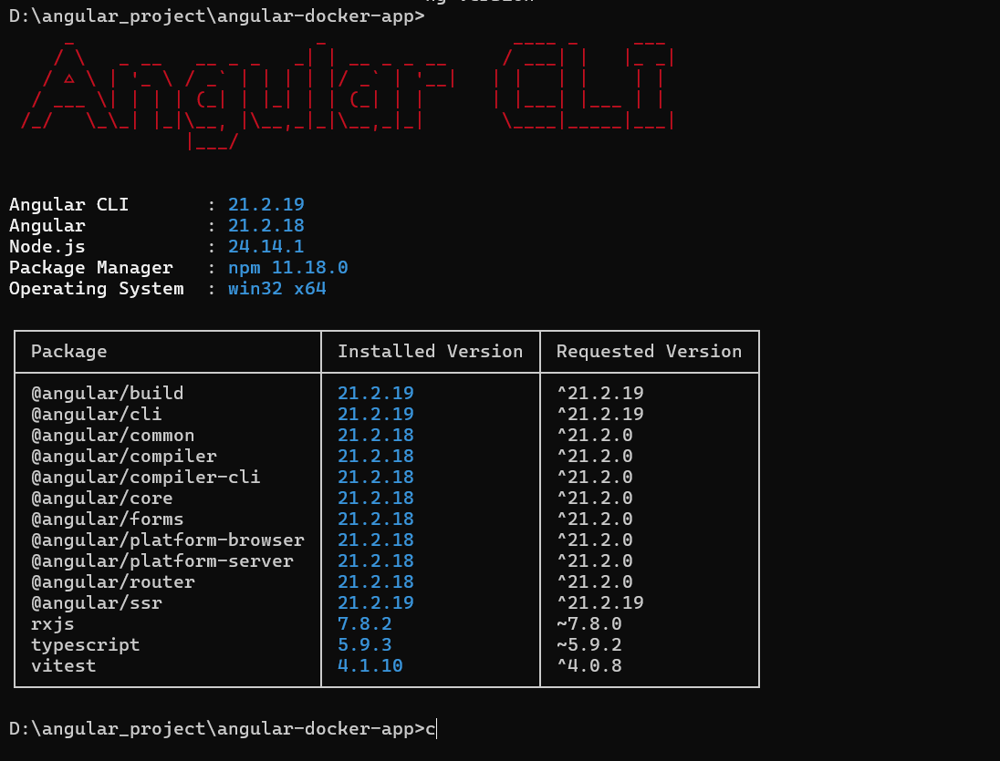

### Step 2
Created a new Angular project using `ng new angular-docker-app` and selected the required project options.

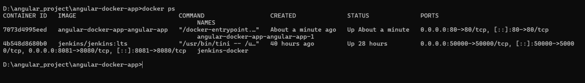

### Step 3
Changed into the project directory and launched the application using `ng serve`.

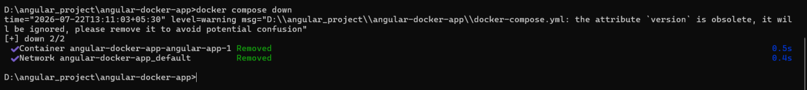

### Step 4
Verified the Angular application was running successfully and built the project using `ng build`.

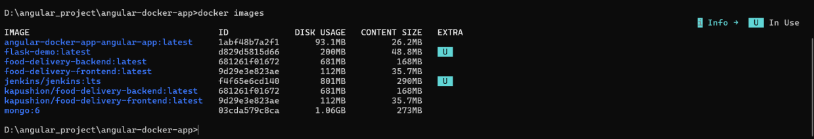

### Step 5
Confirmed the project structure after creating Dockerfile, Dockerfile.dev, Docker Compose files and `.dockerignore`.

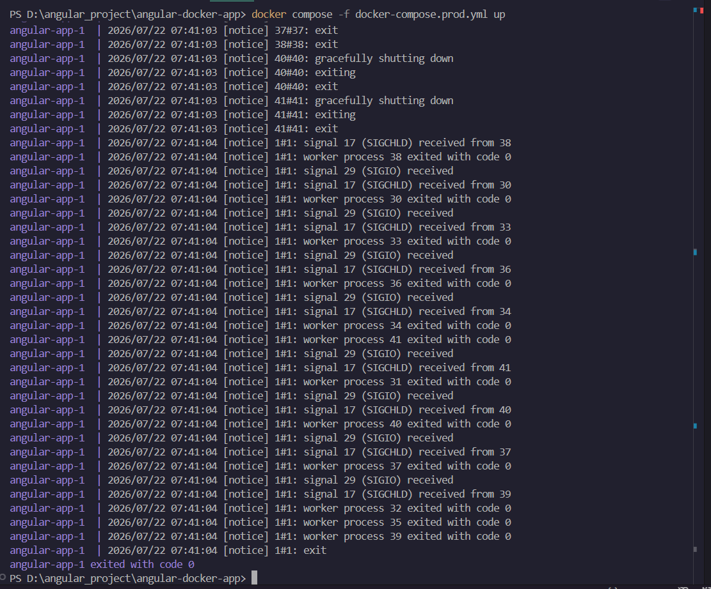

### Step 6
Started the development container using `docker compose up --build`. Docker downloaded the required images and began building the container.

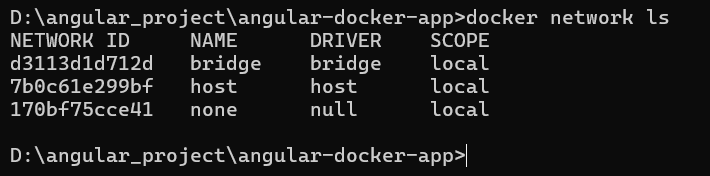

### Step 7
Development container built successfully. Angular application was accessible at http://localhost:4200.

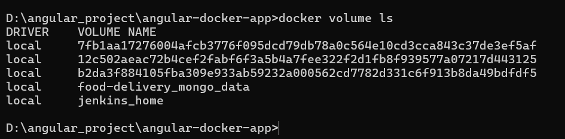

### Step 8
Verified the Angular application running in development mode on localhost:4200.

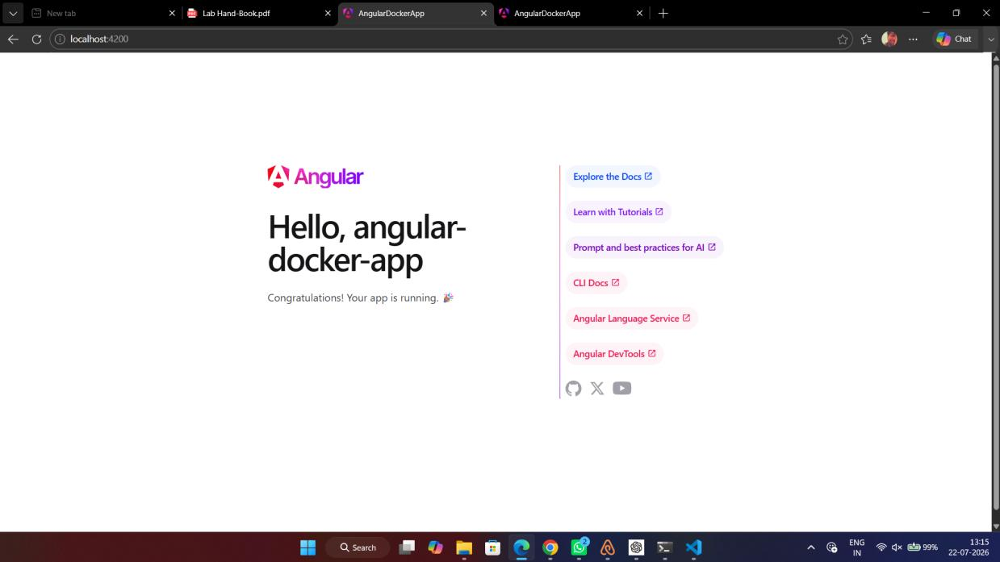

### Step 9
Built the production Docker image using `docker compose -f docker-compose.prod.yml build`.

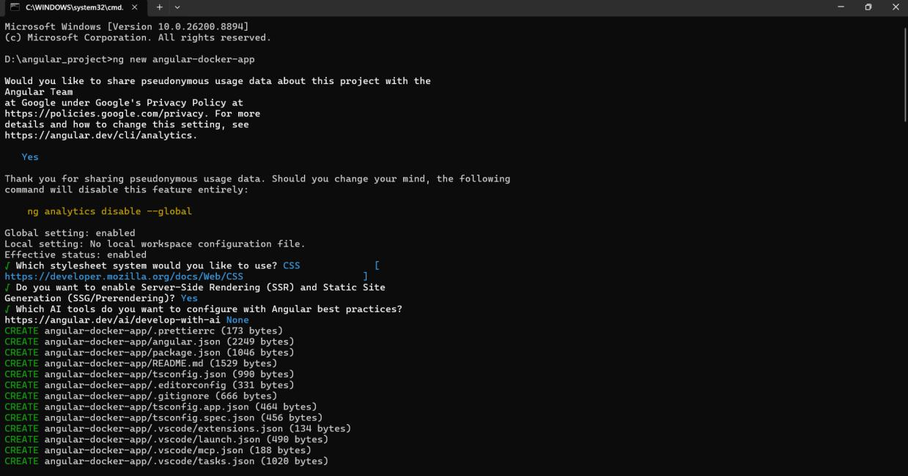

### Step 10
Started the production container using `docker compose -f docker-compose.prod.yml up`. Nginx served the application successfully.

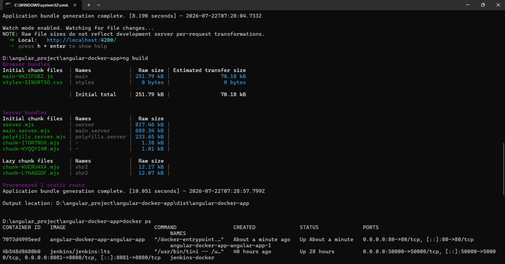

### Step 11
Verified the production deployment by opening http://localhost in the browser.

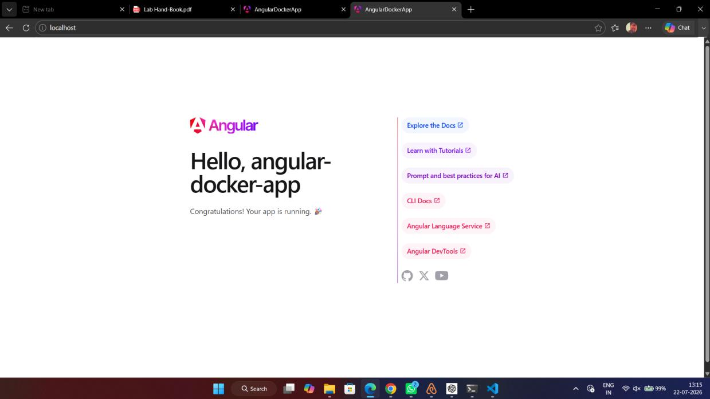

### Step 12
Checked running Docker containers using `docker ps`.

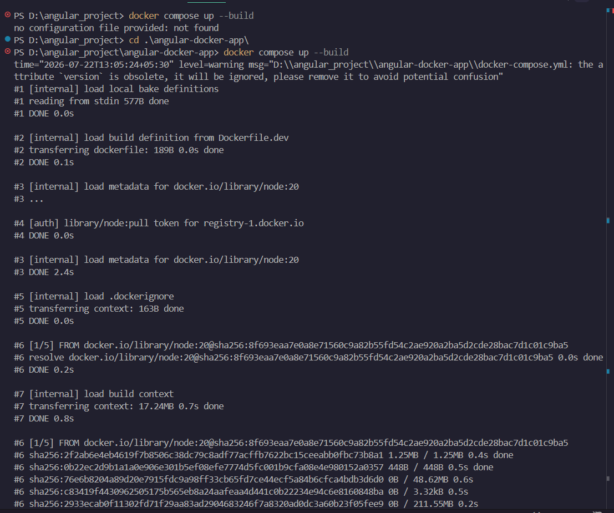

### Step 13
Stopped and removed the Docker Compose containers using `docker compose down`.

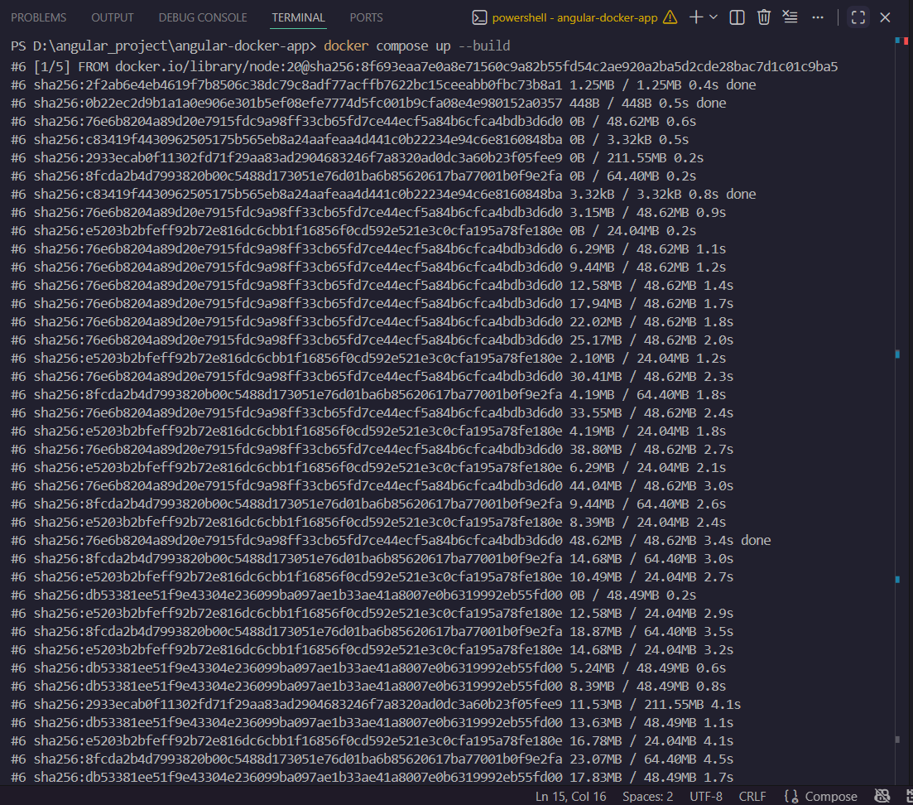

### Step 14
Listed Docker images using `docker images` to verify the Angular image was created.

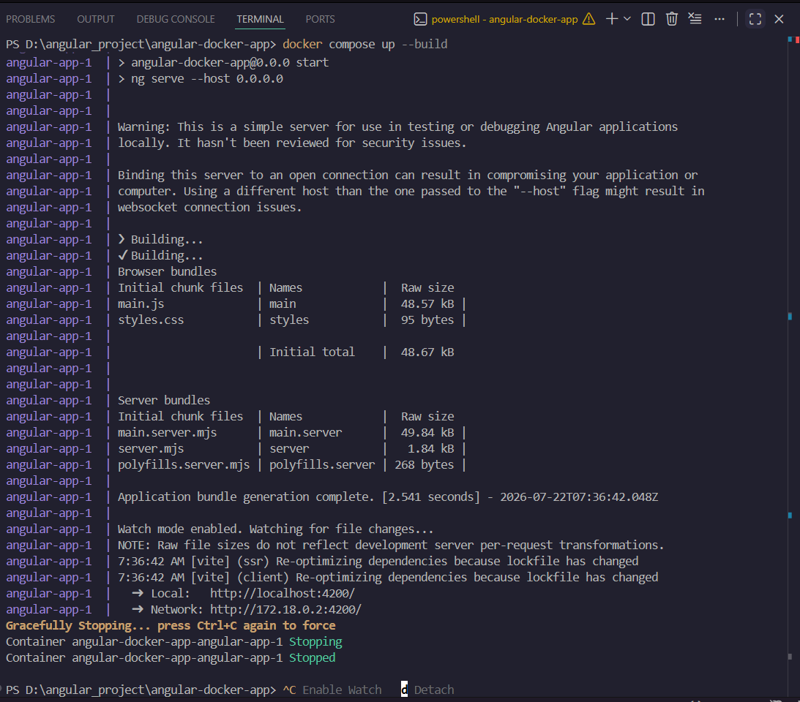

### Step 15
Verified available Docker networks using `docker network ls`.

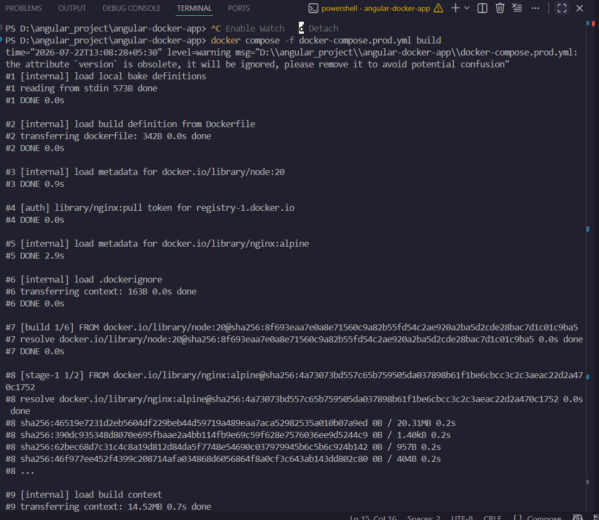

### Step 16
Verified Docker volumes using `docker volume ls`.

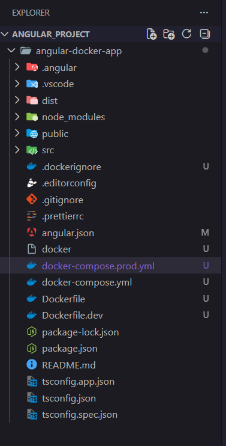

## Result
Successfully dockerized the Angular application, configured development (hot-reload) and production (Nginx-backed multi-stage) environments using Docker Compose, and verified runtime operations using various Docker CLI status commands.

## Conclusion
Docker Compose simplifies environment configurations. By using multi-stage builds, developers can run hot-reloading code in development while keeping the final production image lightweight and fast using Nginx.
