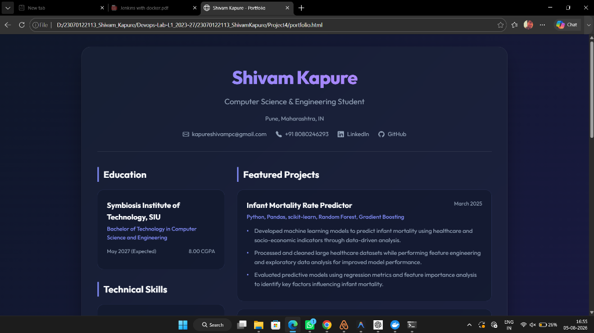
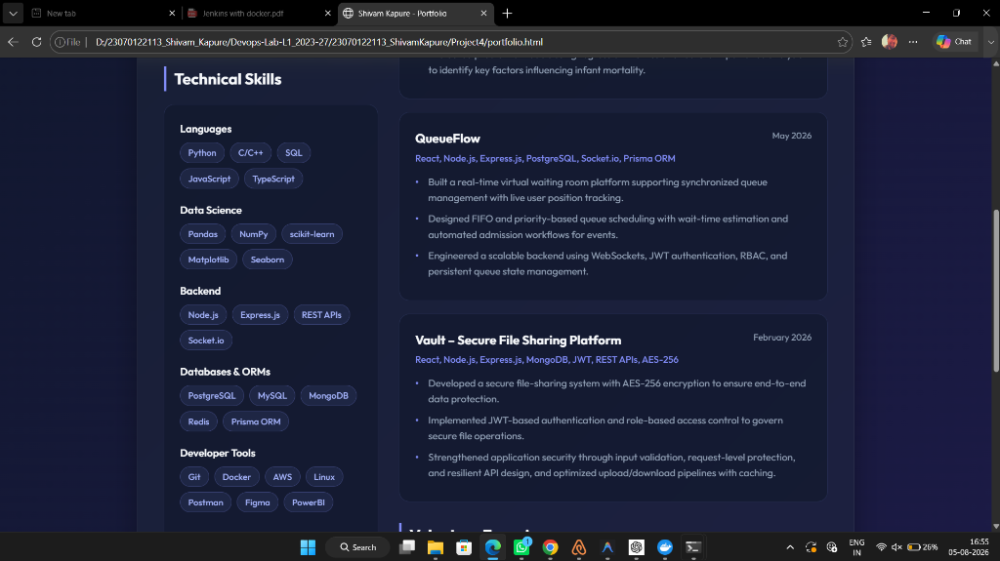
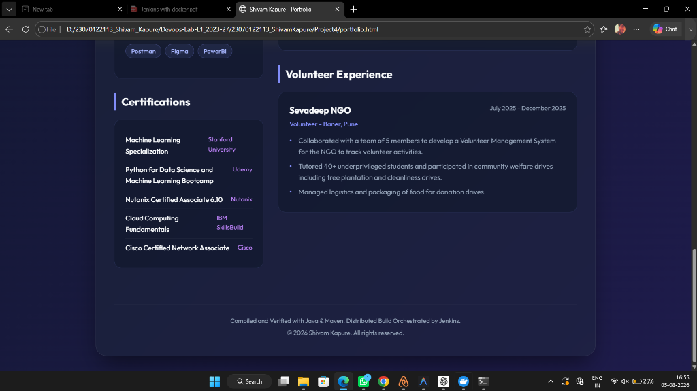
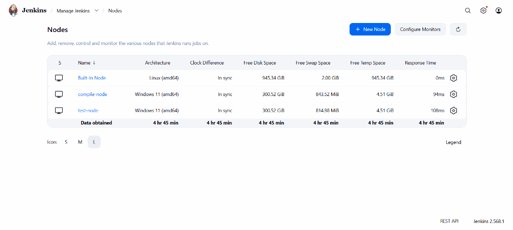
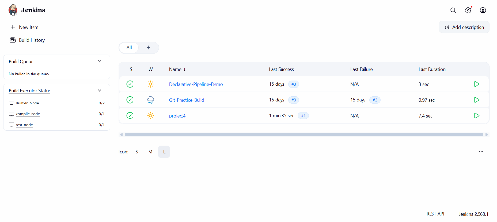
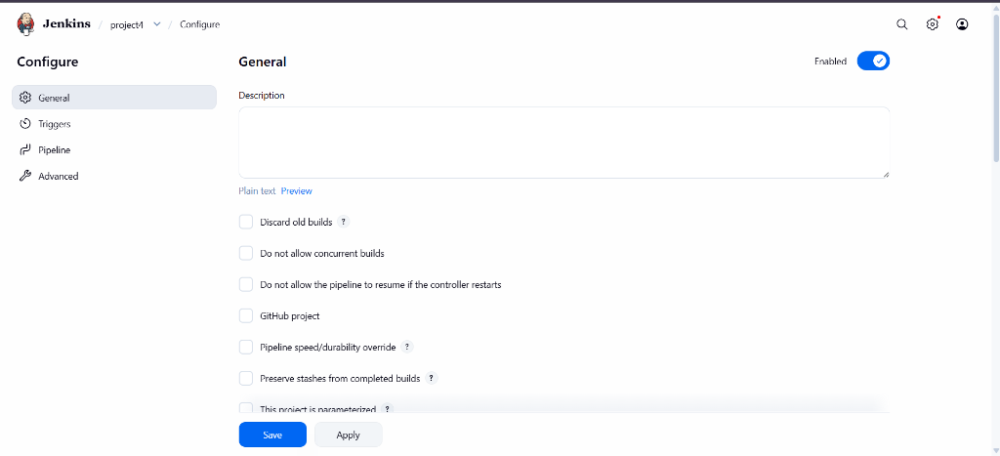
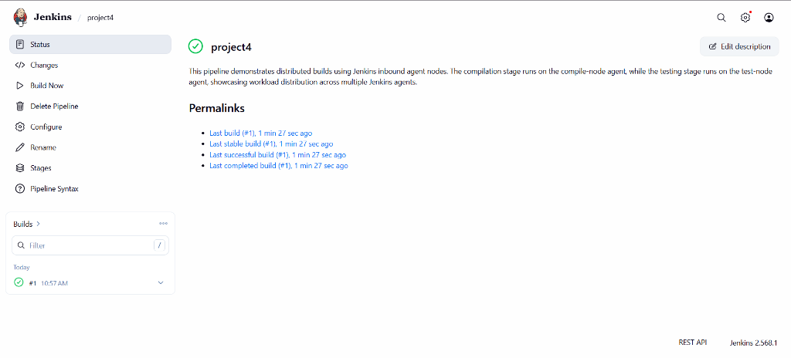
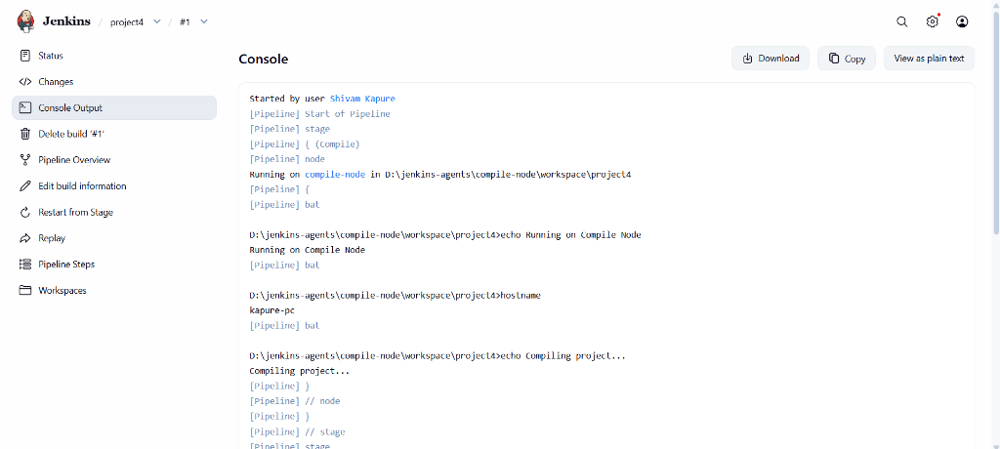
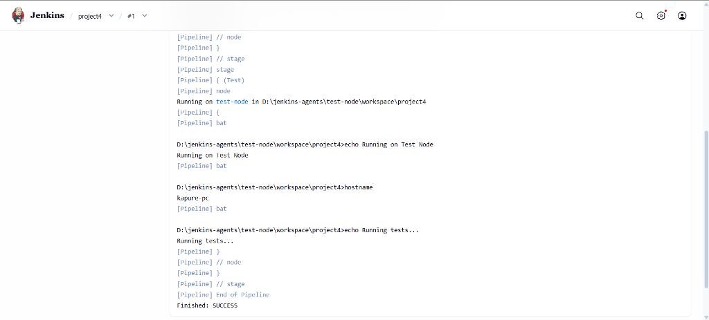

# Jenkins Distributed Pipeline with Local Inbound Agents & Java Maven Portfolio

## Overview

This project demonstrates a **Distributed Jenkins Pipeline** that compiles and tests a Java Maven Portfolio application using two **local inbound agent nodes** running on the same Windows host. Workloads are distributed across dedicated agents using **label-based scheduling** and unified via Jenkins workspace stashing.

The compiled application generates a stunning, responsive **Glassmorphic HTML Portfolio** containing the professional resume details of **Shivam Kapure**.

---

## Architecture

```
                    +-----------------------+
                    |   Jenkins Controller  |
                    |   localhost:8080      |
                    +----------+------------+
                               |
              ---------------------------------------
              |                                     |
              |                                     |
      +-------v--------+                    +--------v-------+
      | compile-node   |                    |   test-node    |
      | Label: compile |                    | Label: test    |
      +----------------+                    +----------------+
              |                                     |
         mvn compile                           mvn test
```

---

## Java Maven Portfolio Application

The application is structured as a Maven project containing the professional credentials, education, certifications, and projects of Shivam Kapure.

### Local Build & Run Instructions
1. **Compile the project**:
   ```bash
   mvn clean compile
   ```
2. **Execute tests**:
   ```bash
   mvn test
   ```
3. **Generate the HTML Portfolio**:
   ```bash
   mvn exec:java
   ```
   *This outputs `portfolio.html` in the root folder, styled using a high-quality glassmorphic dark theme.*

### Portfolio Preview

Below are screenshots of the generated portfolio website:

#### 1. Header & Education (Top Section)


#### 2. Technical Skills & Projects (Middle Section)


#### 3. Certifications & Volunteer Work (Bottom Section)


---

## Jenkins Agent Configuration

To distribute the compilation and test workloads, two permanent agent nodes are configured in Jenkins:

### Node Settings

#### Compile Node
| Property | Value |
|----------|-------|
| Node Name | `compile-node` |
| Label | `compile-node` |
| Launch Method | Inbound Agent |
| Workspace | `D:\jenkins-agents\compile-node` |

#### Test Node
| Property | Value |
|----------|-------|
| Node Name | `test-node` |
| Label | `test-node` |
| Launch Method | Inbound Agent |
| Workspace | `D:\jenkins-agents\test-node` |

### Active Nodes Status
Once configured, the agent list under Jenkins Node Management displays all nodes as **Online and Connected**:



---

## Starting the Agents

Before executing the pipeline, the inbound agents must be run locally from PowerShell or Command Prompt.

### 1. Start the Compile Node
```powershell
java -jar agent.jar ^
-url http://localhost:8080/ ^
-secret <COMPILE_NODE_SECRET> ^
-name compile-node ^
-workDir D:\jenkins-agents\compile-node
```

### 2. Start the Test Node
```powershell
java -jar agent.jar ^
-url http://localhost:8080/ ^
-secret <TEST_NODE_SECRET> ^
-name test-node ^
-workDir D:\jenkins-agents\test-node
```

Upon launching the agents, they will reflect as active in the **Build Executor Status** dashboard:



---

## Jenkins Pipeline script

The declarative pipeline separates stages using the `agent` block. In between the stages, Jenkins stashes and unstashes target assets so the compilation result is successfully tested on the testing agent.

```groovy
pipeline {
    agent none // Do not allocate a global agent; each stage runs on its own specified agent

    options {
        timeout(time: 1, unit: 'HOURS')
        ansiColor('xterm')
    }

    stages {
        stage('Compile') {
            agent {
                label 'compile-node' // Runs on the dedicated compile agent
            }
            steps {
                echo '=== STAGE: Compile ==='
                bat 'hostname'
                bat 'mvn clean compile'
                
                echo 'Stashing compile outputs and project sources for the test node...'
                stash name: 'compiled-project', includes: 'pom.xml, src/**, target/**'
            }
        }

        stage('Test') {
            agent {
                label 'test-node' // Runs on the dedicated testing agent
            }
            steps {
                echo '=== STAGE: Test ==='
                unstash 'compiled-project'
                
                echo 'Running Maven test suite...'
                bat 'hostname'
                bat 'mvn test'
            }
        }
    }
}
```

---

## Job Configurations & Execution

### General Configurations
The pipeline project is configured inside Jenkins as a pipeline job pointing to the script:



### Execution Workflow
1. The developer triggers the pipeline.
2. The **Compile** stage is scheduled on `compile-node`. It pulls resources, compiles the Java files using Maven, and stashes the target folder.
3. The **Test** stage is scheduled on `test-node`. It unstashes the compiled classes and runs the JUnit 5 test suite.
4. If successful, Jenkins highlights the execution status as success.



---

## Build Execution Console Logs

Below are the execution stage logs showing the hostname and execution workspace of each agent:

### 1. Compile Stage Console Output (on `compile-node`)


### 2. Test Stage Console Output (on `test-node`)


---

## Technologies Used

- **CI/CD:** Jenkins 2.568.1, Inbound Agent (agent.jar)
- **Runtime Env:** Java JDK 17 / 24, Windows 11 Host
- **Build Tool:** Apache Maven 3.9.9
- **Libraries:** JUnit Jupiter 5.10.2 (Unit testing)
- **Front-end:** HTML5, Vanilla CSS3 (with responsive Glassmorphism design & Google Fonts)

---

## Learning Outcomes

- Configured Jenkins distributed builds.
- Created and managed local inbound agent nodes on Windows.
- Executed pipeline stages on dedicated agents based on labels.
- Managed separate workspaces and coordinated build files across agents using stash/unstash.
- Understood master-agent architecture in Jenkins.

---

## Author

**Shivam Kapure**
Symbiosis Institute of Technology, SIU
Pune, Maharashtra, IN
