# Project 5 — Containerizing a Spring Boot Application and Scanning Its Docker Image

## 1. Project Overview

This project demonstrates how to containerize a Spring Boot retail web application, deploy it as a Docker container, test its endpoints, inspect the Docker image, and scan the image for known vulnerabilities.

### Final configuration used for the main run

- **Application:** `retail-app`
- **Java:** 25.0.3
- **Spring Boot:** 4.1.0
- **Build tool:** Maven
- **Application port:** 8082
- **Docker image:** `retail-app:1.0`
- **Container:** `retail-container1`
- **Port mapping:** `8082:8082`
- **Image scanner:** Docker Scout

### Architecture

```text
Spring Boot Application
        |
        v
     Maven Build
        |
        v
Executable JAR
        |
        v
    Dockerfile
        |
        v
Docker Image: retail-app:1.0
        |
        v
Docker Container: retail-container1
        |
        v
localhost:8082
        |
        v
Docker Scout CVE Scan
```

---

## 2. Prerequisites

The following were used for the project:

- Java JDK 25.0.3
- Maven Wrapper included in the Spring Boot project
- Docker Desktop
- PowerShell on Windows
- A Spring Boot application exposing `/`, `/products`, and `/orders`

---

## 3. Spring Boot Application

The application represents a retail company's web application.

The application exposes these endpoints:

| Endpoint | Purpose |
|---|---|
| `/` | Retail application home page |
| `/products` | Product catalog |
| `/orders` | Order management |

The application is configured to use port **8082**:

```properties
server.port=8082
spring.application.name=retail-app
```

### Controller

The controller provides:

```java
@GetMapping("/")
public String home() {
    return "Retail Company Web Application is Running!";
}

@GetMapping("/products")
public String products() {
    return "Product Catalog: Laptop, Smartphone, Headphones, Smart Watch";
}

@GetMapping("/orders")
public String orders() {
    return "Order Management Service is Running!";
}
```

---

## 4. Run the Application Locally

The application was started using the Maven Wrapper:

```powershell
.\mvnw.cmd spring-boot:run
```

The Spring Boot output confirms Java 25.0.3 and Tomcat on port 8082.

### Evidence

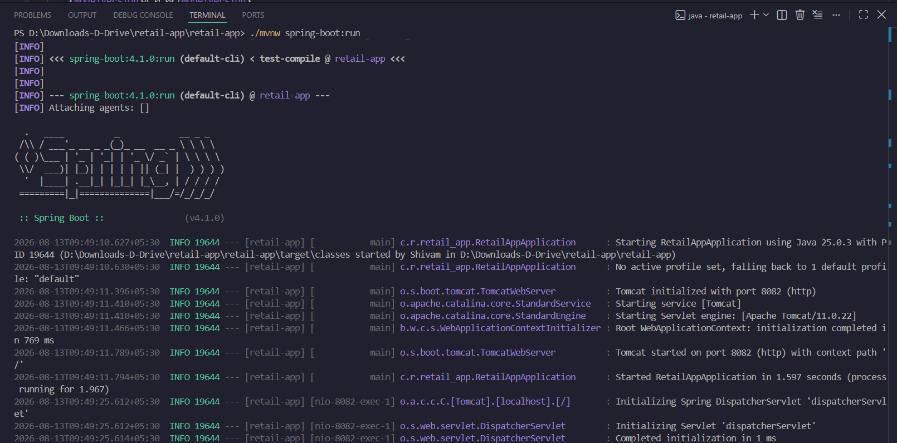

---

## 5. Build the Spring Boot JAR

The executable JAR was generated using:

```powershell
.\mvnw.cmd clean package
```

The build completed successfully and the `target` directory was created.

### Evidence


The target directory contains two JAR-related files. The executable JAR used by Docker is:

```text
retail-app-0.0.1-SNAPSHOT.jar
```

The `.original` file is not used in the Dockerfile.

### JAR selection evidence

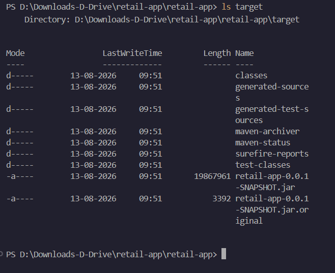

---

## 6. Dockerfile

The Dockerfile uses a Java 25 JRE image and copies the executable Spring Boot JAR into the container.

```dockerfile
FROM eclipse-temurin:25-jre-ubi10-minimal

WORKDIR /app

COPY target/retail-app-0.0.1-SNAPSHOT.jar app.jar

EXPOSE 8082

ENTRYPOINT ["java", "-jar", "app.jar"]
```

### Explanation

- `FROM` selects the Java 25 runtime image.
- `WORKDIR /app` creates the working directory.
- `COPY` copies the executable JAR into the image.
- `EXPOSE 8082` documents the application port.
- `ENTRYPOINT` starts the Spring Boot application.

---

## 7. Build the Docker Image

The image was built with:

```powershell
docker build -t retail-app:1.0 .
```

The build completed successfully.

### Evidence

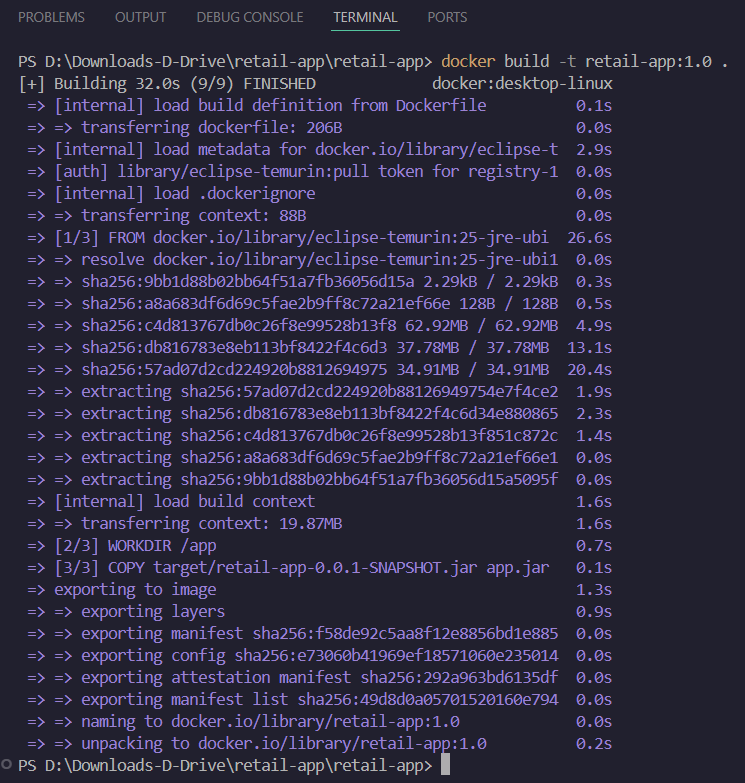

---

## 8. Verify the Docker Image

The created images were checked with:

```powershell
docker images
```

The required image is:

```text
retail-app:1.0
```

### Evidence

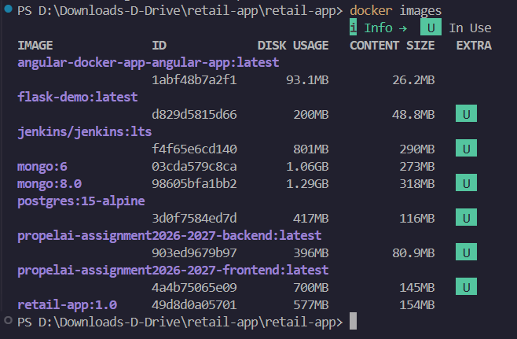

---

## 9. Run the Docker Container

The Spring Boot application was deployed in a Docker container using:

```powershell
docker run -d --name retail-container1 -p 8082:8082 retail-app:1.0
```

This maps:

```text
Host port 8082
      |
      v
Container port 8082
```

The running container was verified with:

```powershell
docker ps
```

### Evidence

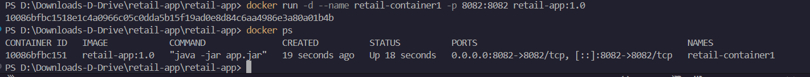

---

## 10. Test the Home Endpoint

Open:

```text
http://localhost:8082
```

Expected response:

```text
Retail Company Web Application is Running!
```

### Evidence

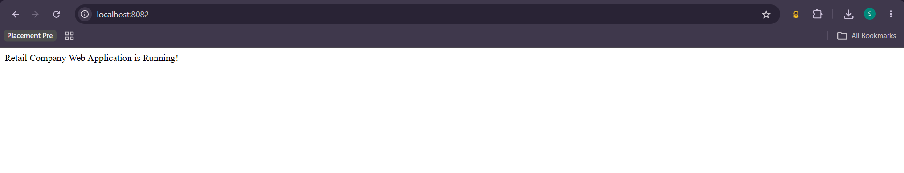

---

## 11. Test the Products Endpoint

Open:

```text
http://localhost:8082/products
```

Expected response:

```text
Product Catalog: Laptop, Smartphone, Headphones, Smart Watch
```

### Evidence

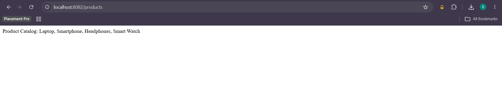

---

## 12. Test the Orders Endpoint

Open:

```text
http://localhost:8082/orders
```

Expected response:

```text
Order Management Service is Running!
```

### Evidence

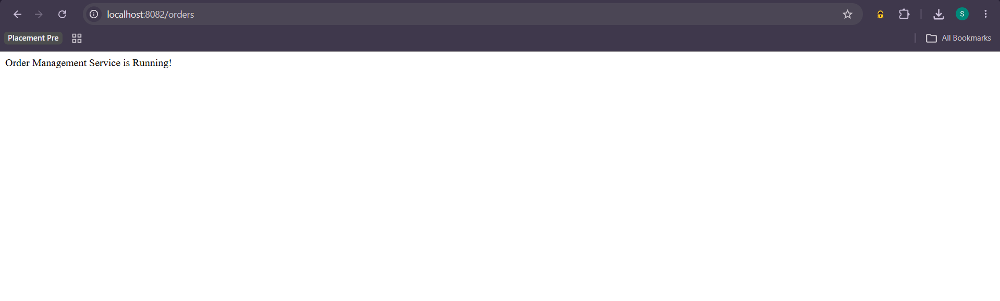

---

## 13. Check Docker Container Logs

The application logs were checked using:

```powershell
docker logs retail-container1
```

The logs show:

- Spring Boot started successfully.
- Java 25.0.3 is being used.
- Tomcat started successfully.
- Port 8082 is initialized.

### Evidence


---

## 14. Inspect Docker Image Layers

The image history was inspected using:

```powershell
docker history retail-app:1.0
```

This displays the layers created from the Dockerfile, including:

- Base image
- Environment configuration
- JAR copy
- Exposed port
- Container entry point

### Evidence

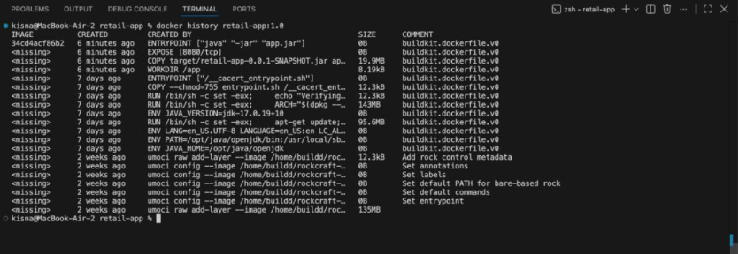

---

## 15. Scan the Docker Image for Vulnerabilities

Docker Scout was used to scan the image:

```powershell
docker scout cves local://retail-app:1.0
```

The scan checks packages in the image against known Common Vulnerabilities and Exposures (CVEs).

The successful scan evidence shows:

- Image indexed successfully.
- Packages analyzed.
- One vulnerable package was detected.
- The reported package is `jackson-databind` 3.1.4.
- The screenshot reports CVE-2026-59889 with MEDIUM severity.

### Evidence

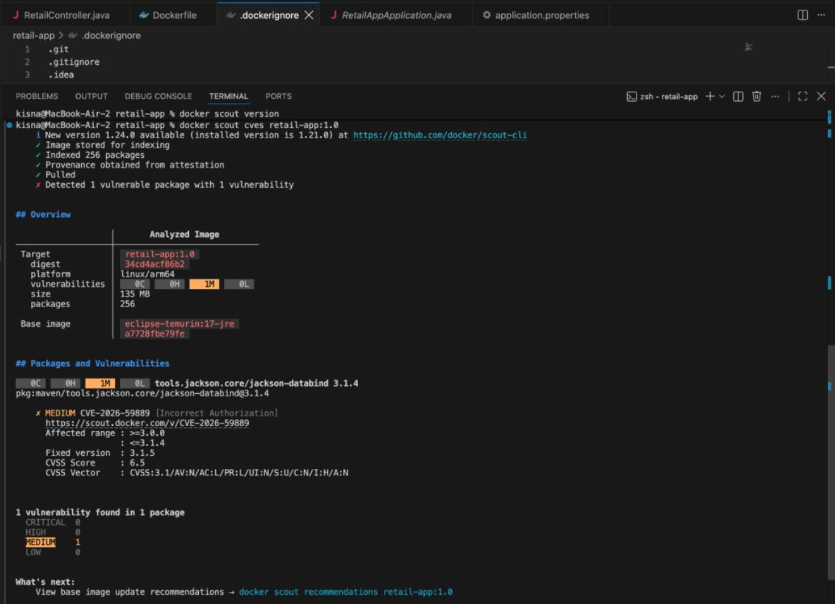

### Important note

A vulnerability finding does not mean the Docker build failed. The purpose of this step is to identify security issues in the image so that the base image or affected dependency can be updated.

---

## 16. Supplementary Evidence

The following screenshots are retained because they document earlier/intermediate runs during development.

### Earlier Home Page Evidence


### Earlier Products Evidence

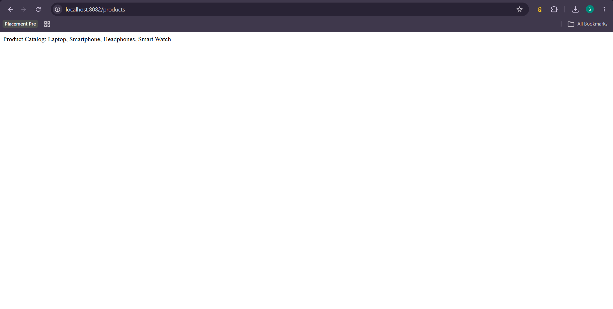

### Earlier Orders Evidence

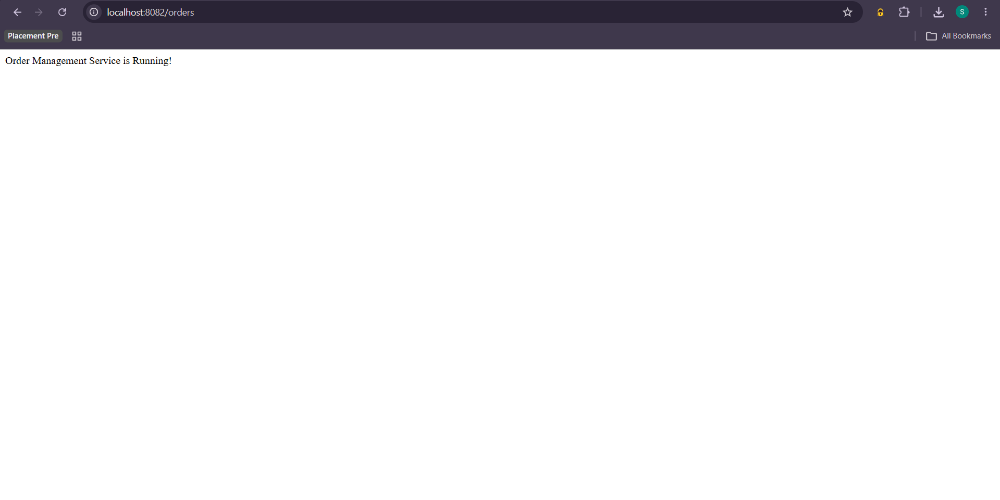

### Intermediate Container Evidence

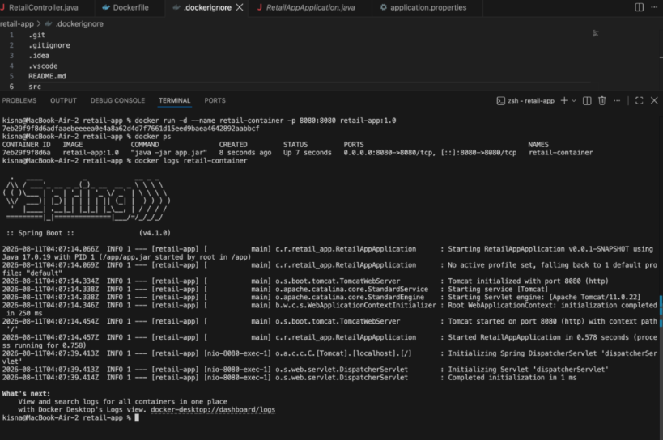

> **Note:** The intermediate container screenshot shows an earlier configuration using Java 17 and port 8080. The main/final configuration documented in this README uses Java 25.0.3 and port 8082.

---

## 17. Useful Docker Commands

### List images

```powershell
docker images
```

### List running containers

```powershell
docker ps
```

### List all containers

```powershell
docker ps -a
```

### View container logs

```powershell
docker logs retail-container1
```

### Stop the container

```powershell
docker stop retail-container1
```

### Start the container

```powershell
docker start retail-container1
```

### Remove the container

```powershell
docker rm retail-container1
```

### Remove the image

```powershell
docker rmi retail-app:1.0
```

### Inspect image layers

```powershell
docker history retail-app:1.0
```

### Scan the image

```powershell
docker scout cves local://retail-app:1.0
```

---

## 18. Final Result

The Spring Boot retail application was successfully:

1. Built with Maven.
2. Packaged as an executable JAR.
3. Containerized using Docker.
4. Built as the image `retail-app:1.0`.
5. Deployed as `retail-container1`.
6. Exposed through port `8082`.
7. Tested through the home, products, and orders endpoints.
8. Verified through Docker logs and image history.
9. Scanned using Docker Scout for known vulnerabilities.

### Final deployment

```text
Docker Image
retail-app:1.0
       |
       v
Docker Container
retail-container1
       |
       | 8082:8082
       v
http://localhost:8082
```

---

## 19. Project Deliverables

This package contains:

```text
Project5_Retail_App_Docker/
├── README.md
└── screenshots/
    ├── 01-spring-boot-local.png
    ├── 02-maven-build-and-jar.png
    ├── 03-jar-files.png
    ├── 04-docker-build.png
    ├── 05-docker-image-list.png
    ├── 06-container-run-and-ps.png
    ├── 07-home-page.png
    ├── 08-products-endpoint.png
    ├── 09-orders-endpoint.png
    ├── 10-container-logs.png
    ├── 11-docker-history.png
    ├── 12-scout-vulnerability-scan.png
    ├── 13-older-home-page-evidence.png
    ├── 14-older-products-evidence.png
    ├── 15-older-orders-evidence.png
    └── 16-intermediate-container-evidence.png
```

