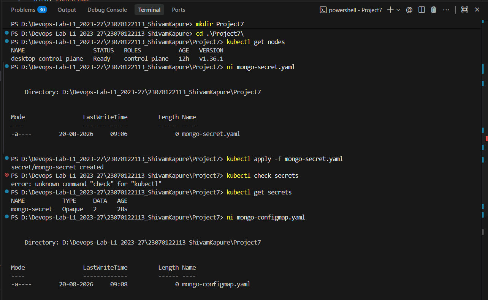
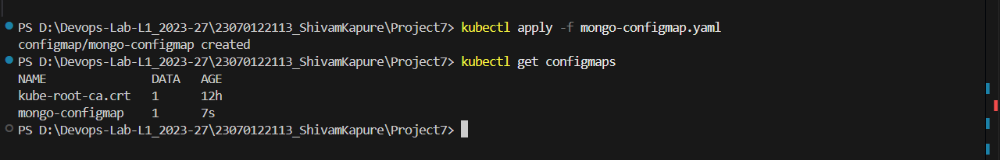
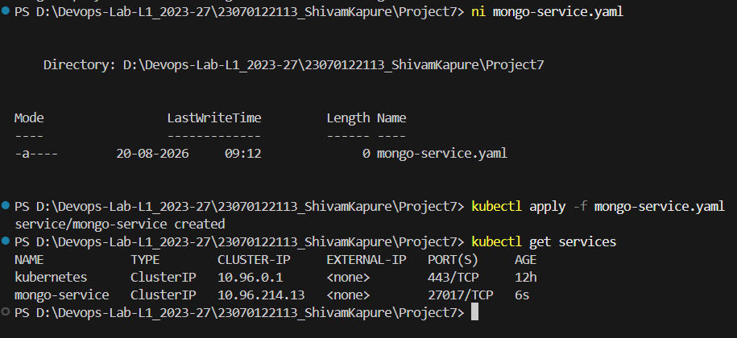
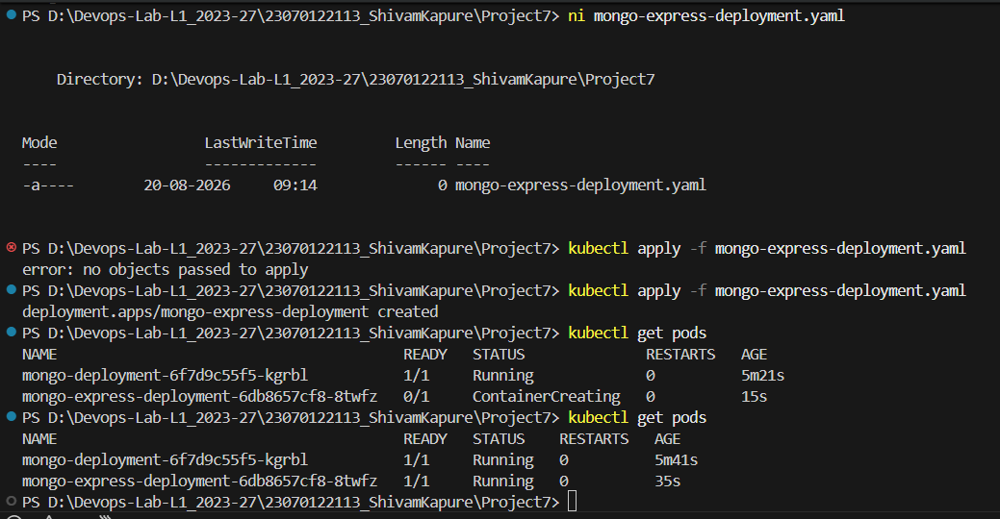
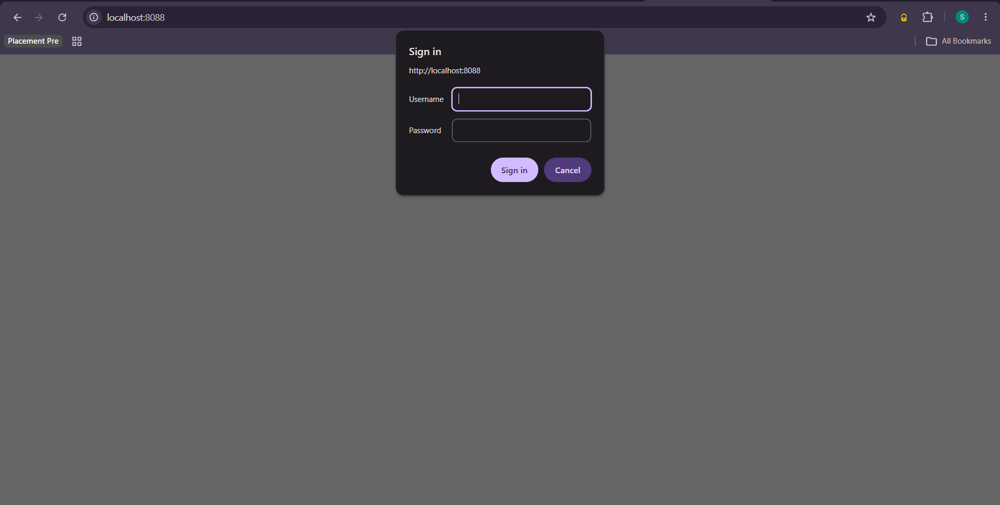
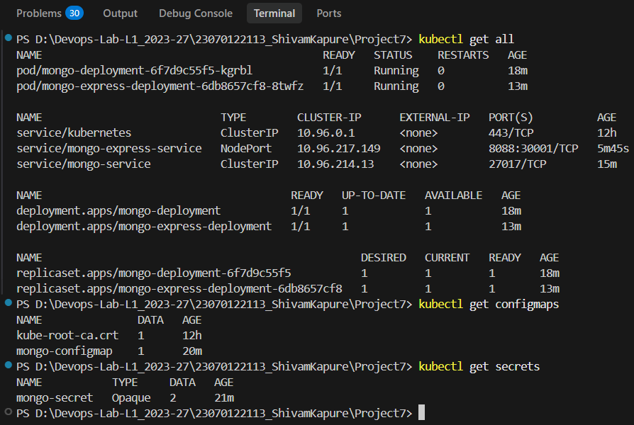
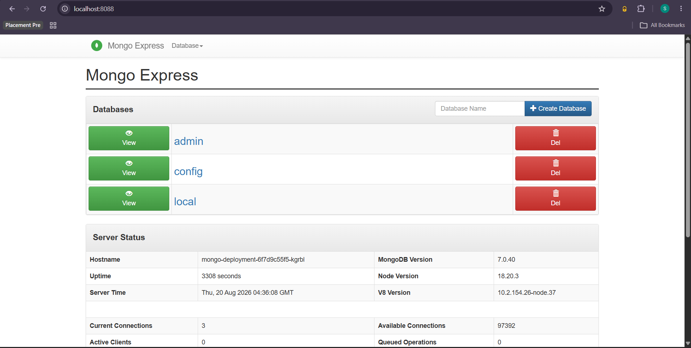
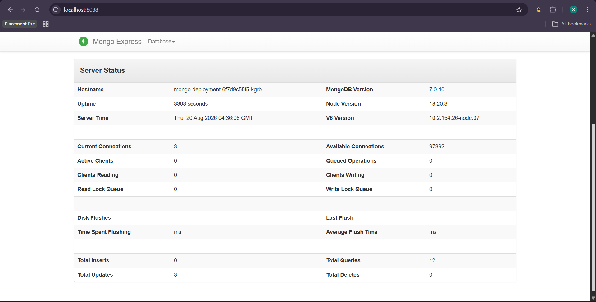

# Project 7 — MongoDB and Mongo Express using Kubernetes

## 1. Introduction

Kubernetes is a container orchestration platform used to deploy, manage, scale, and network containerized applications. In this project, Kubernetes is used to deploy **MongoDB** as the database and **Mongo Express** as a web-based interface for managing MongoDB.

The project demonstrates four important Kubernetes concepts:

- **Deployment** — manages the Pods running MongoDB and Mongo Express.
- **Service** — provides stable networking between Pods and exposes Mongo Express.
- **ConfigMap** — stores non-sensitive configuration such as the MongoDB Service name.
- **Secret** — stores sensitive MongoDB credentials.

The final architecture is:

```text
                         Browser
                            |
                            | localhost:30001
                            v
                 Mongo Express Service
                    NodePort: 30001
                    Service: 8088
                            |
                            | targetPort 8081
                            v
                 Mongo Express Pod
                            |
                            | mongo:27017
                            v
                    MongoDB Service
                     ClusterIP:27017
                            |
                            v
                     MongoDB Pod
                            ^
                            |
                  Secret + ConfigMap
```

## 2. Prerequisites

Before starting:

1. Install and start Docker Desktop.
2. Enable Kubernetes from **Docker Desktop → Settings → Kubernetes**.
3. Wait until Kubernetes is running.
4. Make sure `kubectl` is available in PowerShell.

Verify the Kubernetes cluster:

```powershell
kubectl get nodes
```

The Docker Desktop node should have the status `Ready`.



---

## 3. Create the Project Directory

Create a folder for the project and open it in PowerShell:

```powershell
mkdir Project7-Mongo
cd Project7-Mongo
```

The final project contains these Kubernetes manifests:

```text
Project7/
├── mongo-secret.yaml
├── mongo-configmap.yaml
├── mongo-deployment.yaml
├── mongo-service.yaml
├── mongo-express-deployment.yaml
└── mongo-express-service.yaml
```

---

## 4. Create the MongoDB Secret

A Kubernetes **Secret** stores sensitive information separately from the application configuration. In this project, the Secret stores the MongoDB username and password.

Create `mongo-secret.yaml`:

```yaml
apiVersion: v1
kind: Secret
metadata:
  name: mongo-secret
type: Opaque
data:
  mongo-user: bW9uZ28=
  mongo-password: bW9uZ29wYXNz
```

Apply the Secret:

```powershell
kubectl apply -f mongo-secret.yaml
```

Verify:

```powershell
kubectl get secrets
```

The Secret is then referenced by the MongoDB and Mongo Express Deployments.



---

## 5. Create the MongoDB ConfigMap

A **ConfigMap** stores non-sensitive configuration. Mongo Express needs to know the Kubernetes Service through which MongoDB can be reached.

Create `mongo-configmap.yaml`:

```yaml
apiVersion: v1
kind: ConfigMap
metadata:
  name: mongo-configmap
data:
  mongo-url: mongo
```

Apply it:

```powershell
kubectl apply -f mongo-configmap.yaml
```

Verify:

```powershell
kubectl get configmaps
```

The value `mongo` is the name of the MongoDB Service.



---

## 6. Create the MongoDB Deployment

A **Deployment** manages the desired state of a set of Pods. Here, one MongoDB Pod is created.

Create `mongo-deployment.yaml`:

```yaml
apiVersion: apps/v1
kind: Deployment
metadata:
  name: mongo-deployment
spec:
  replicas: 1
  selector:
    matchLabels:
      app: mongo
  template:
    metadata:
      labels:
        app: mongo
    spec:
      containers:
        - name: mongodb
          image: mongo:7
          ports:
            - containerPort: 27017
          env:
            - name: MONGO_INITDB_ROOT_USERNAME
              valueFrom:
                secretKeyRef:
                  name: mongo-secret
                  key: mongo-user
            - name: MONGO_INITDB_ROOT_PASSWORD
              valueFrom:
                secretKeyRef:
                  name: mongo-secret
                  key: mongo-password
```

Apply:

```powershell
kubectl apply -f mongo-deployment.yaml
```

Check the Deployment:

```powershell
kubectl get deployments
```

Check the Pod:

```powershell
kubectl get pods
```

The MongoDB Pod should eventually show:

```text
1/1   Running
```



---

## 7. Create the MongoDB Service

A Kubernetes **Service** gives Pods a stable network endpoint. Pod IP addresses can change, so Mongo Express should communicate with the MongoDB Service instead of directly using the Pod IP.

Create `mongo-service.yaml`:

```yaml
apiVersion: v1
kind: Service
metadata:
  name: mongo
spec:
  selector:
    app: mongo
  ports:
    - protocol: TCP
      port: 27017
      targetPort: 27017
```

Apply:

```powershell
kubectl apply -f mongo-service.yaml
```

Verify:

```powershell
kubectl get services
```

Verify that the Service points to the MongoDB Pod:

```powershell
kubectl get endpoints mongo
```

An endpoint similar to the following confirms that the Service is connected to the MongoDB Pod:

```text
mongo   10.244.x.x:27017
```


---

## 8. Create the Mongo Express Deployment

Mongo Express provides a web interface for MongoDB. Its Deployment uses:

- The ConfigMap to obtain the MongoDB Service name.
- The Secret to obtain MongoDB credentials.
- Basic Authentication credentials for the Mongo Express web interface.

Mongo Express listens internally on port `8081`.

Create `mongo-express-deployment.yaml`:

```yaml
apiVersion: apps/v1
kind: Deployment
metadata:
  name: mongo-express-deployment
spec:
  replicas: 1
  selector:
    matchLabels:
      app: mongo-express
  template:
    metadata:
      labels:
        app: mongo-express
    spec:
      containers:
        - name: mongo-express
          image: mongo-express:1.0.2
          ports:
            - containerPort: 8081
          env:
            - name: ME_CONFIG_MONGODB_SERVER
              valueFrom:
                configMapKeyRef:
                  name: mongo-configmap
                  key: mongo-url

            - name: ME_CONFIG_MONGODB_ADMINUSERNAME
              valueFrom:
                secretKeyRef:
                  name: mongo-secret
                  key: mongo-user

            - name: ME_CONFIG_MONGODB_ADMINPASSWORD
              valueFrom:
                secretKeyRef:
                  name: mongo-secret
                  key: mongo-password

            - name: ME_CONFIG_BASICAUTH_USERNAME
              value: "admin"

            - name: ME_CONFIG_BASICAUTH_PASSWORD
              value: "admin123"
```

Apply:

```powershell
kubectl apply -f mongo-express-deployment.yaml
```

Check:

```powershell
kubectl get pods
```

Both MongoDB and Mongo Express Pods should show `Running`.



---

## 9. Verify Mongo Express Configuration

The Mongo Express Pod should receive the following values:

```text
ME_CONFIG_MONGODB_SERVER=mongo
ME_CONFIG_MONGODB_ADMINUSERNAME=mongo
ME_CONFIG_MONGODB_ADMINPASSWORD=mongopass
ME_CONFIG_BASICAUTH_USERNAME=admin
ME_CONFIG_BASICAUTH_PASSWORD=admin123
```

They can be verified using:

```powershell
kubectl exec deployment/mongo-express-deployment -- printenv ME_CONFIG_MONGODB_SERVER
kubectl exec deployment/mongo-express-deployment -- printenv ME_CONFIG_MONGODB_ADMINUSERNAME
kubectl exec deployment/mongo-express-deployment -- printenv ME_CONFIG_MONGODB_ADMINPASSWORD
kubectl exec deployment/mongo-express-deployment -- printenv ME_CONFIG_BASICAUTH_USERNAME
kubectl exec deployment/mongo-express-deployment -- printenv ME_CONFIG_BASICAUTH_PASSWORD
```

This confirms that Mongo Express receives its MongoDB connection information and Basic Authentication credentials.


---

## 10. Create the Mongo Express Service

Mongo Express listens on port `8081` inside its Pod. The Kubernetes Service uses port `8088`, while NodePort `30001` provides external access.

Create `mongo-express-service.yaml`:

```yaml
apiVersion: v1
kind: Service
metadata:
  name: mongo-express-service
spec:
  selector:
    app: mongo-express
  type: NodePort
  ports:
    - protocol: TCP
      port: 8088
      targetPort: 8081
      nodePort: 30001
```

The port mapping is:

```text
Browser → NodePort 30001 → Service 8088 → Pod 8081
```

Apply:

```powershell
kubectl apply -f mongo-express-service.yaml
```

Verify:

```powershell
kubectl get services
```

Expected output includes:

```text
mongo-express-service   NodePort   ...   8088:30001/TCP
```



---

## 11. Access Mongo Express

### Using NodePort

Open the following URL in the browser:

```text
http://localhost:30001
```

Use the Mongo Express Basic Authentication credentials:

```text
Username: admin
Password: admin123
```

### Using Port Forwarding

Alternatively, access the Service on localhost port `8088`:

```powershell
kubectl port-forward service/mongo-express-service 8088:8088
```

Then open:

```text
http://localhost:8088
```

Keep the PowerShell window running while using the application.



---

## 12. Final Verification

Verify all Kubernetes resources:

```powershell
kubectl get pods
kubectl get deployments
kubectl get services
kubectl get configmaps
kubectl get secrets
kubectl get all
```

The expected resources are:

```text
Deployments:
- mongo-deployment
- mongo-express-deployment

Services:
- mongo
- mongo-express-service

ConfigMap:
- mongo-configmap

Secret:
- mongo-secret
```

Both Pods should be in the `Running` state.



---

## 13. Troubleshooting

If a Pod fails, check:

```powershell
kubectl get pods
```

View logs:

```powershell
kubectl logs deployment/mongo-express-deployment
```

View detailed Pod information:

```powershell
kubectl describe pod <pod-name>
```

Check the MongoDB Service endpoint:

```powershell
kubectl get endpoints mongo
```

A valid endpoint such as:

```text
10.244.x.x:27017
```

indicates that the MongoDB Service is correctly connected to the MongoDB Pod.

---

## 14. Result

The Kubernetes application was successfully configured with:

- MongoDB Deployment
- MongoDB ClusterIP Service
- Mongo Express Deployment
- Mongo Express NodePort Service
- ConfigMap
- Secret
- Mongo Express Basic Authentication
- Kubernetes networking between Mongo Express and MongoDB

The application can be accessed through Mongo Express after authentication, demonstrating the use of Kubernetes Deployments, Services, ConfigMaps, and Secrets.
