# Project 8 — Kubernetes Microservices Application

## CampusLink — DevOps Lab Event Hub

This project demonstrates how to containerize and deploy a complete application made up of **four independent microservices** using Docker and Kubernetes.

The application is a simple campus event-management system called **CampusLink**.

### Microservices

| Service | Purpose | Application Port | Kubernetes Service |
|---|---|---:|---|
| Frontend | Web dashboard and user interaction | `31781` | NodePort |
| Student Service | Provides student information | `31782` | ClusterIP |
| Event Service | Provides campus event information | `31783` | ClusterIP |
| Registration Service | Creates and retrieves event registrations | `31784` | ClusterIP |

No API Gateway is used.

## Architecture

```text
                         Browser
                            |
                            v
                    +----------------+
                    |    Frontend    |
                    |     :31781     |
                    +-------+--------+
                            |
              +-------------+-------------+
              |             |             |
              v             v             v
       +-------------+ +-------------+ +------------------+
       |   Student   | |    Event    | |   Registration   |
       |   Service   | |   Service   | |     Service     |
       |    :31782   | |    :31783   | |      :31784     |
       +-------------+ +-------------+ +------------------+

              Kubernetes Namespace: project8

              ConfigMap: app-config
              Secret: app-secret
```

The backend services communicate through Kubernetes DNS names:

```text
http://student-service:31782
http://event-service:31783
http://registration-service:31784
```

---

# 1. Project Objectives

The main objectives of this experiment are:

- Create a complete application using four microservices.
- Run and test each service locally.
- Create Docker images for every service.
- Deploy the services using Kubernetes Deployments.
- Expose the services using Kubernetes Services.
- Use a ConfigMap for non-sensitive configuration.
- Use a Secret for sensitive configuration.
- Demonstrate Kubernetes replica management.
- Demonstrate Kubernetes service discovery.
- Access the frontend through Kubernetes.
- Verify the complete application end-to-end.

---

# 2. Project Structure

The application is organized as follows:

```text
Project8/
│
├── frontend/
│   ├── app.py
│   ├── requirements.txt
│   ├── Dockerfile
│   ├── templates/
│   │   └── index.html
│   └── static/
│       └── style.css
│
├── student-service/
│   ├── app.py
│   ├── requirements.txt
│   └── Dockerfile
│
├── event-service/
│   ├── app.py
│   ├── requirements.txt
│   └── Dockerfile
│
├── registration-service/
│   ├── app.py
│   ├── requirements.txt
│   └── Dockerfile
│
└── k8s/
    ├── namespace.yaml
    ├── configmap.yaml
    ├── secret.yaml
    ├── frontend-deployment.yaml
    ├── frontend-service.yaml
    ├── student-deployment.yaml
    ├── student-service.yaml
    ├── event-deployment.yaml
    ├── event-service.yaml
    ├── registration-deployment.yaml
    └── registration-service.yaml
```

---

# 3. Step 1 — Test the Microservices Locally

Before containerization and Kubernetes deployment, each Flask service was tested independently.

## Registration Service

The Registration Service runs on port `31784` and its `/` and `/registrations` endpoints were tested successfully.

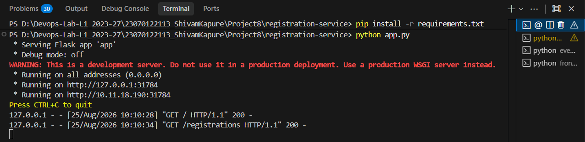

## Student Service

The Student Service runs on port `31782`. The screenshot shows successful requests to `/` and `/students`.

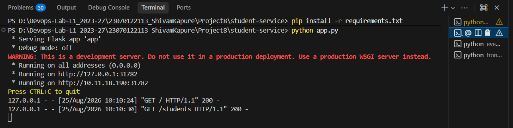

## Event Service

The Event Service runs on port `31783`. The screenshot shows successful requests to `/` and `/events`.

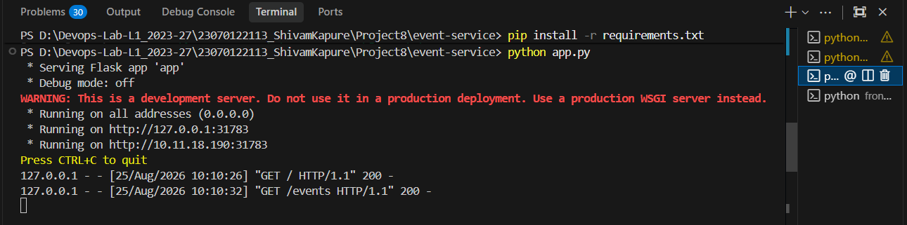

## Frontend

The Frontend runs on port `31781`.

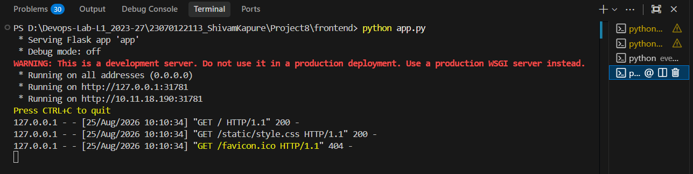

These tests verify that all four application components work independently before being deployed to Kubernetes.

---

# 4. Step 2 — Build Docker Images

Each microservice has its own Dockerfile.

The images can be built from the project root with:

```powershell
docker build -t frontend:latest ./frontend
docker build -t student-service:latest ./student-service
docker build -t event-service:latest ./event-service
docker build -t registration-service:latest ./registration-service
```

Verify the images:

```powershell
docker images
```

The Docker image list shows the application images alongside the Kubernetes/container runtime images.

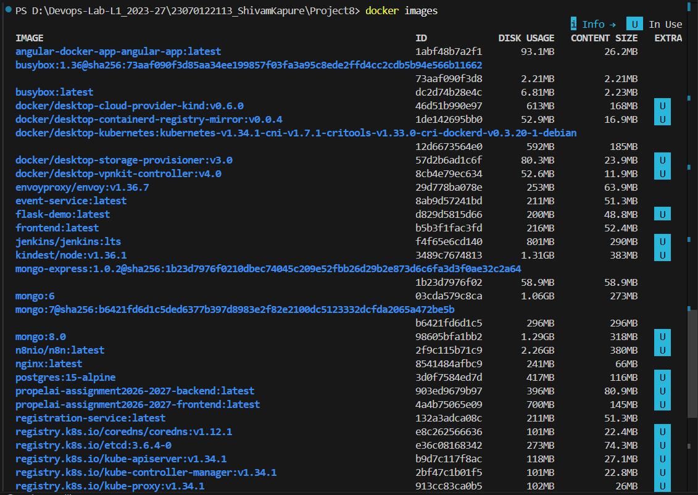

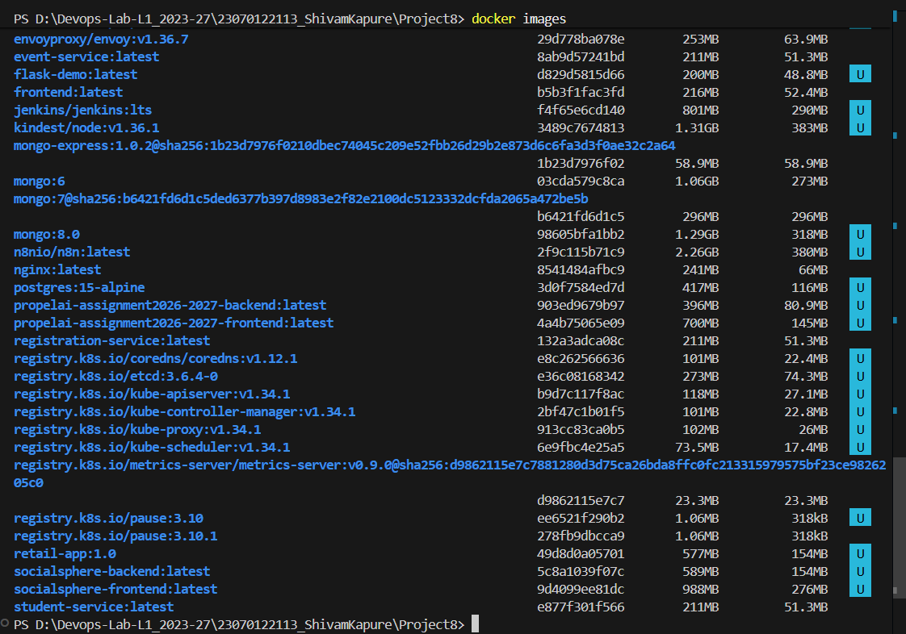

Additional Docker image verification was performed after the images were built.

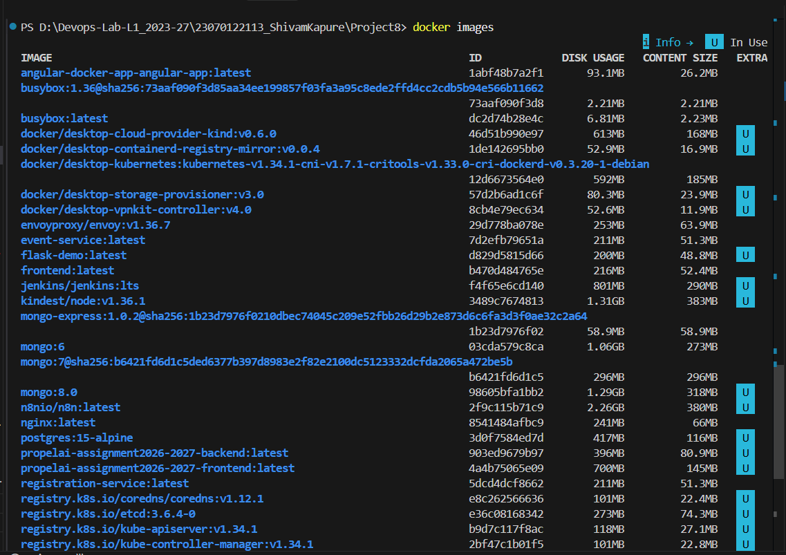

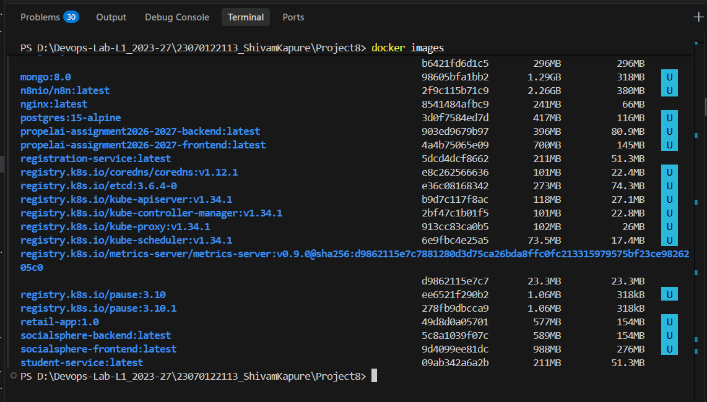

The important application images are:

```text
frontend
student-service
event-service
registration-service
```

---

# 5. Step 3 — Create the Kubernetes Namespace

The Kubernetes resources are isolated in the `project8` namespace.

Apply the namespace:

```powershell
kubectl apply -f k8s/namespace.yaml
```

Verify it:

```powershell
kubectl get namespaces
```

All remaining Kubernetes resources are deployed into:

```text
project8
```

---

# 6. Step 4 — Create the ConfigMap

The ConfigMap stores non-sensitive application configuration.

Apply it:

```powershell
kubectl apply -f k8s/configmap.yaml
```

Verify it:

```powershell
kubectl get configmap app-config -n project8 -o yaml
```

The ConfigMap contains the service URLs:

```text
STUDENT_SERVICE_URL=http://student-service:31782
EVENT_SERVICE_URL=http://event-service:31783
REGISTRATION_SERVICE_URL=http://registration-service:31784
```

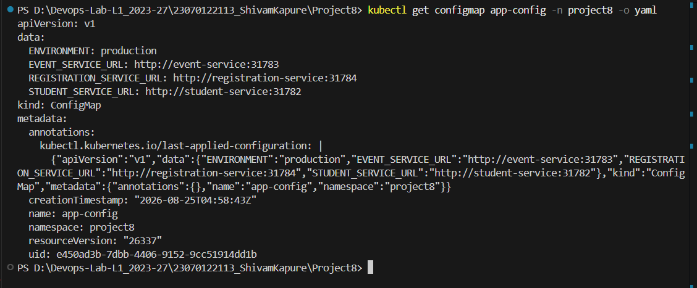

A later verification also confirms the ConfigMap and service DNS configuration.

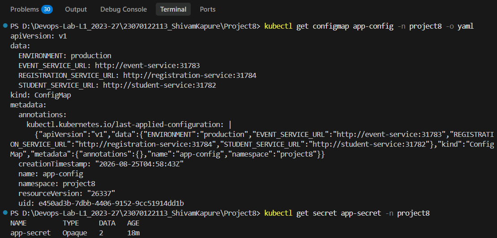

---

# 7. Step 5 — Create the Kubernetes Secret

The Secret is used for sensitive configuration.

Apply it:

```powershell
kubectl apply -f k8s/secret.yaml
```

Verify that it exists:

```powershell
kubectl get secret app-secret -n project8
```

The Secret is of type `Opaque` and contains two data entries.

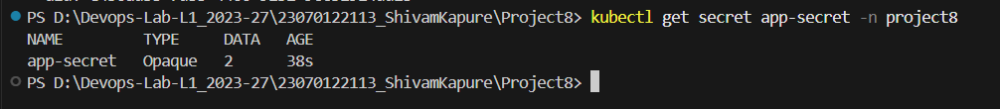

The actual secret values should not be exposed in documentation or screenshots.

---

# 8. Step 6 — Deploy the Four Microservices

Apply all Kubernetes manifests:

```powershell
kubectl apply -f k8s/
```

This creates:

- 4 Deployments
- 4 Services
- 1 ConfigMap
- 1 Secret
- Multiple Pods

Each Deployment is configured with **2 replicas**.

Therefore the application should normally have:

```text
Frontend:             2 Pods
Student Service:      2 Pods
Event Service:        2 Pods
Registration Service: 2 Pods
```

for a total of **8 running Pods**.

---

# 9. Step 7 — Verify Kubernetes Resources

Check all resources:

```powershell
kubectl get all -n project8
```

The output shows the Pods, Services, Deployments and ReplicaSets.

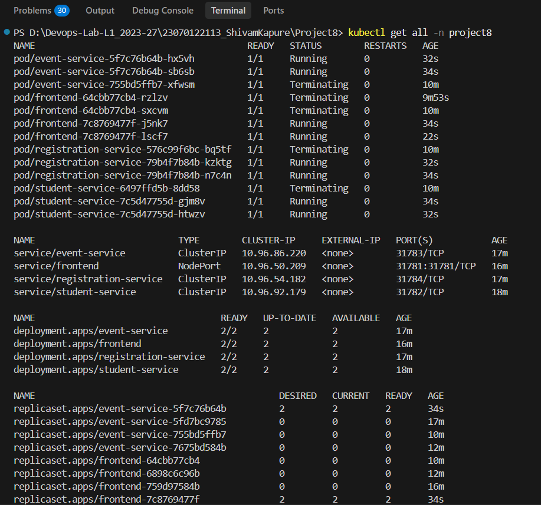

A more focused verification shows the four Services and four Deployments. The backend services use `ClusterIP`, while the frontend is exposed through `NodePort`.

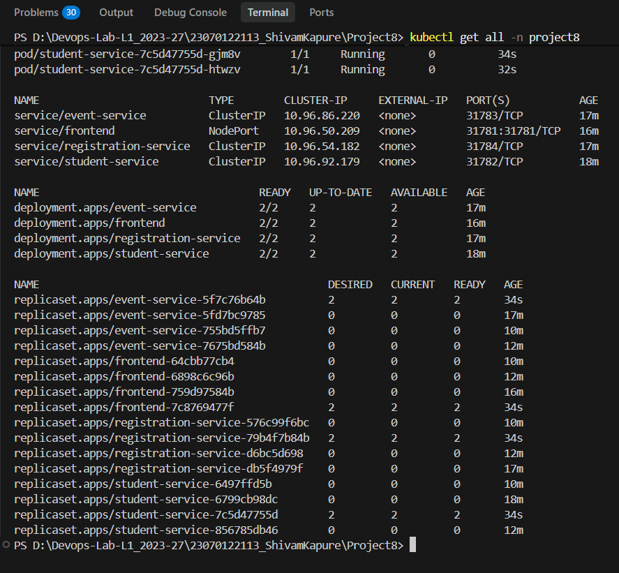

Expected services:

```text
event-service          ClusterIP     31783/TCP
frontend               NodePort      31781:31781/TCP
registration-service   ClusterIP     31784/TCP
student-service        ClusterIP     31782/TCP
```

Expected Deployments:

```text
event-service
frontend
registration-service
student-service
```

Each Deployment should show:

```text
READY   2/2
UP-TO-DATE   2
AVAILABLE    2
```

---

# 10. Step 8 — Access the Frontend

The frontend Kubernetes Service is exposed using NodePort.

One way used for this project is port forwarding:

```powershell
kubectl port-forward svc/frontend 31781:31781 -n project8
```

The successful forwarding output is shown below.

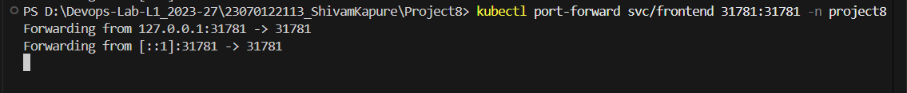

Then open:

```text
http://localhost:31781
```

The CampusLink dashboard should appear.

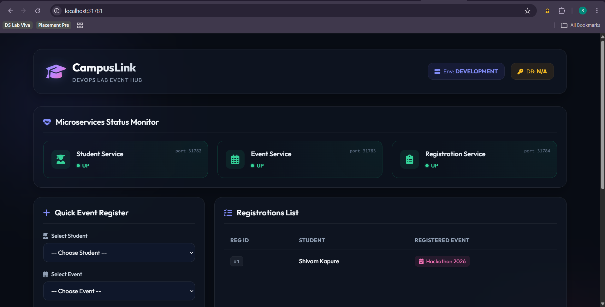

---

# 11. Step 9 — Verify Microservice Status

The dashboard displays the status of the three backend microservices:

```text
Student Service       Port 31782       UP
Event Service         Port 31783       UP
Registration Service  Port 31784       UP
```

The frontend successfully retrieves information from the backend services through their Kubernetes service names.

The application dashboard also displays registration information.

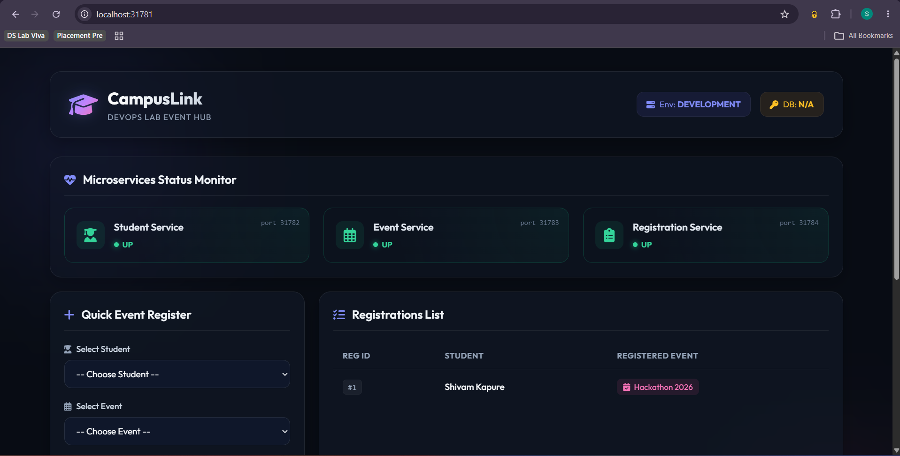

---

# 12. Step 10 — Verify Application Data

The dashboard displays the Student Database and Active Campus Events.

Example students include:

```text
Shivam Kapure
Rahul Sharma
```

Example events include:

```text
Hackathon 2026
Tech Symposium
```

The registration list demonstrates that the frontend can retrieve information from the Registration Service.

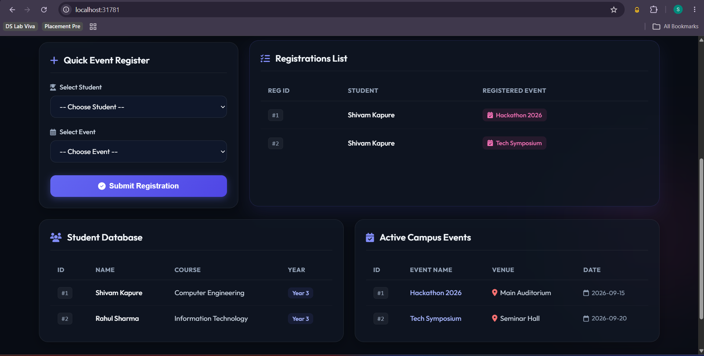

---

# 13. Step 11 — Test Event Registration

The frontend provides a Quick Event Register form.

A student and event can be selected and submitted.

After submission, the application displays:

```text
Student successfully registered for the event!
```

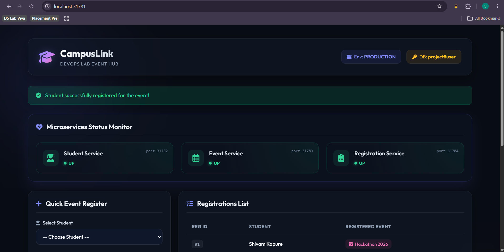

The registration then appears in the registrations list.

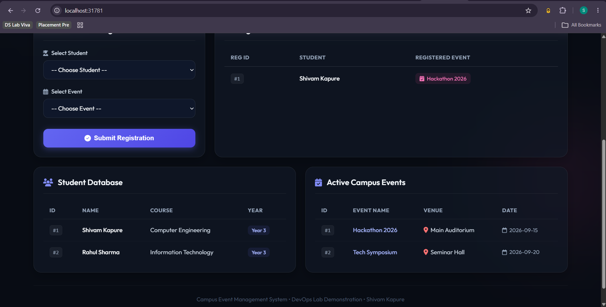

---

# 14. Step 12 — Verify Registration Service Logs

The Registration Service logs demonstrate that Kubernetes successfully routed requests to the service.

The logs show:

```text
GET /
POST /registrations
GET /registrations
```

with successful HTTP responses.

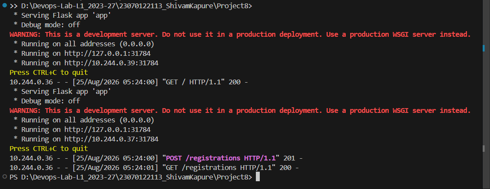

This confirms that the Registration Service is actively processing application requests.

---

# 15. Kubernetes Service Discovery

The application does not use `localhost` for backend communication inside Kubernetes.

Instead, Kubernetes DNS service names are used:

```text
student-service
event-service
registration-service
```

with the configured ports:

```text
student-service:31782
event-service:31783
registration-service:31784
```

The ConfigMap provides these URLs to the frontend.

This demonstrates Kubernetes' built-in service discovery mechanism.

---

# 16. ConfigMap vs Secret

## ConfigMap

The ConfigMap stores configuration that is not sensitive.

Examples:

```text
ENVIRONMENT
STUDENT_SERVICE_URL
EVENT_SERVICE_URL
REGISTRATION_SERVICE_URL
```

## Secret

The Secret stores sensitive values.

Examples:

```text
DATABASE_USERNAME
DATABASE_PASSWORD
```

This separation prevents sensitive credentials from being stored directly in application configuration.

---

# 17. Why Deployments Are Used

A Kubernetes Deployment manages the Pods belonging to each microservice.

Each service has:

```text
replicas: 2
```

This provides:

- Replication
- Higher availability
- Automatic Pod recreation
- Declarative management
- Easy scaling

For example:

```powershell
kubectl scale deployment student-service --replicas=3 -n project8
```

can increase the Student Service to three replicas.

---

# 18. Why Services Are Used

Pods are temporary Kubernetes resources and their IP addresses can change.

A Kubernetes Service provides a stable endpoint.

The project uses:

```text
frontend               NodePort
student-service        ClusterIP
event-service          ClusterIP
registration-service   ClusterIP
```

The backend services are internal because they do not need to be directly accessed from the browser.

Only the frontend needs external access.

---

# 19. Useful Verification Commands

Check Pods:

```powershell
kubectl get pods -n project8
```

Check Deployments:

```powershell
kubectl get deployments -n project8
```

Check Services:

```powershell
kubectl get services -n project8
```

Check ConfigMap:

```powershell
kubectl get configmap app-config -n project8
```

Check Secret:

```powershell
kubectl get secret app-secret -n project8
```

Check everything:

```powershell
kubectl get all -n project8
```

View logs:

```powershell
kubectl logs deployment/registration-service -n project8
```

Describe a Pod:

```powershell
kubectl describe pod <pod-name> -n project8
```

---

# 20. Final Result

The completed application demonstrates the complete DevOps workflow:

```text
Application
     |
     v
Four Microservices
     |
     v
Docker Images
     |
     v
Kubernetes Deployments
     |
     v
Kubernetes Pods
     |
     v
Kubernetes Services
     |
     +-----------------------+
     |                       |
     v                       v
ConfigMap                 Secret
     |                       |
     +-----------+-----------+
                 |
                 v
       Running Microservices
                 |
                 v
          CampusLink UI
```

The project successfully demonstrates:

- **4 microservices**
- **4 Dockerfiles**
- **4 Docker images**
- **4 Kubernetes Deployments**
- **4 Kubernetes Services**
- **2 replicas per Deployment**
- **ConfigMap**
- **Secret**
- **Kubernetes service discovery**
- **Containerized Flask applications**
- **Frontend access through Kubernetes**
- **End-to-end event registration**

---

# 21. Conclusion

Project 8 successfully demonstrates how a multi-service application can be containerized with Docker and orchestrated using Kubernetes. The four services are independently deployable and communicate through Kubernetes Services. Deployments provide replica management, ConfigMaps provide centralized non-sensitive configuration, and Secrets provide protected configuration values.

The final CampusLink application is accessible through the Kubernetes frontend and demonstrates successful communication between the Student, Event, and Registration microservices.
