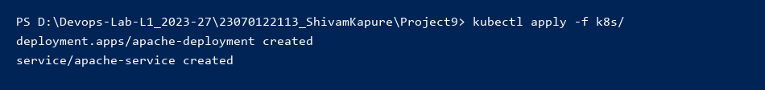
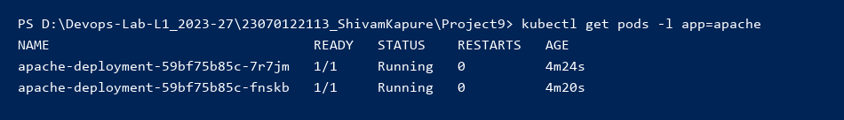
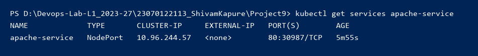

# Project 9 - Create Apache2 Server within a Deployment

**Student Name:** Shivam Kapure  
**PRN:** 23070122113  
**Course:** DevOps Lab  

---

## 📌 Project Overview

This project demonstrates how to deploy an Apache HTTP Server (`httpd`) inside a Kubernetes cluster using a **Deployment** and expose it to the host machine using a **NodePort Service**.

### Key Kubernetes Concepts Covered:
1. **Deployments:** Managing a ReplicaSet of 2 `httpd` pods for high availability.
2. **Services (NodePort):** Exposing the internal port `80` to the host machine port `30987`.

---

## 📁 Project Structure

```text
Project9/
├── k8s/
│   ├── apache-deployment.yaml
│   └── apache-service.yaml
├── screenshots/
└── README.md
```

---

## ⚙️ Step 1: Kubernetes Manifests

### 1. `k8s/apache-deployment.yaml`
This manifest defines a Deployment for the Apache web server. It uses the official `httpd:2.4` Docker image and scales to 2 replicas.

```yaml
apiVersion: apps/v1
kind: Deployment
metadata:
  name: apache-deployment
spec:
  replicas: 2
  selector:
    matchLabels:
      app: apache
  template:
    metadata:
      labels:
        app: apache
    spec:
      containers:
        - name: apache
          image: httpd:2.4
          ports:
            - containerPort: 80
```

### 2. `k8s/apache-service.yaml`
This Service exposes the Apache pods externally using a `NodePort` which maps internal port `80` to the unconventional host port `30987`.

```yaml
apiVersion: v1
kind: Service
metadata:
  name: apache-service
spec:
  selector:
    app: apache
  type: NodePort
  ports:
    - protocol: TCP
      port: 80
      targetPort: 80
      nodePort: 30987
```

---

## 🚀 Step 2: Deploy to Kubernetes Cluster

To apply the configuration, navigate to the `Project9` folder in the terminal and execute:

```powershell
kubectl apply -f k8s/
```

*(Screenshot: Output of kubectl apply)*  


---

## 🔍 Step 3: Verify Deployment

Check if the Deployments, Pods, and Services are correctly running:

### 1. Verify Pods Status
```powershell
kubectl get pods -l app=apache
```
*(Screenshot: Pods running)*  


### 2. Verify Services & Port Bindings
```powershell
kubectl get services apache-service
```
*(Screenshot: Service exposing port 30987)*  


---

## 🌐 Step 4: Access Apache Server from Host Machine

Since we are running kind locally on Windows, establish host-to-cluster network translation by running a port-forwarding command from PowerShell:

```powershell
kubectl port-forward service/apache-service 18087:80
```

Open your web browser and navigate to:
👉 **[http://localhost:18087](http://localhost:18087)**

You should see the default Apache "It works!" page, proving the Apache web server is successfully responding to traffic from the host machine!

*(Screenshot: Apache web server displaying custom UI)*  


---

## 🎯 Conclusion
In this project, we successfully:
1. Deployed an **Apache2 (`httpd`)** web server within a Kubernetes Deployment.
2. Exposed the server to the external host machine network using a **Kubernetes Service**.
