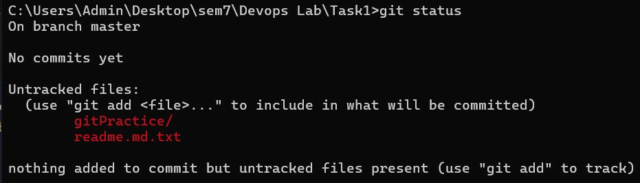
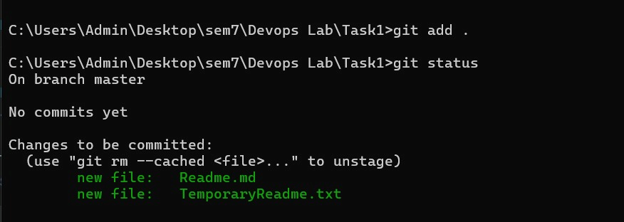
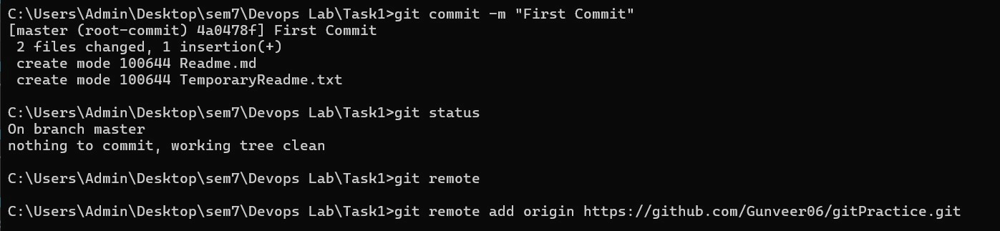
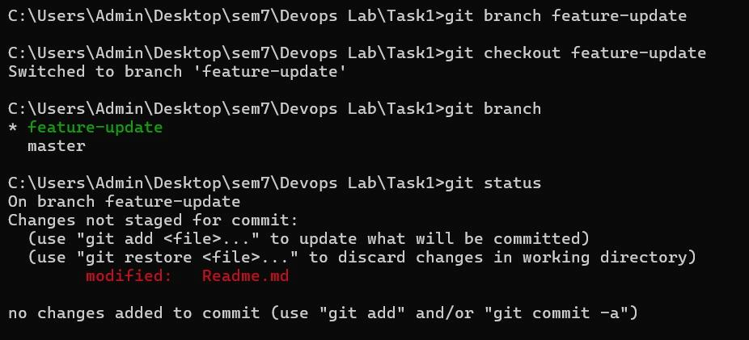
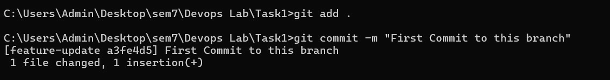
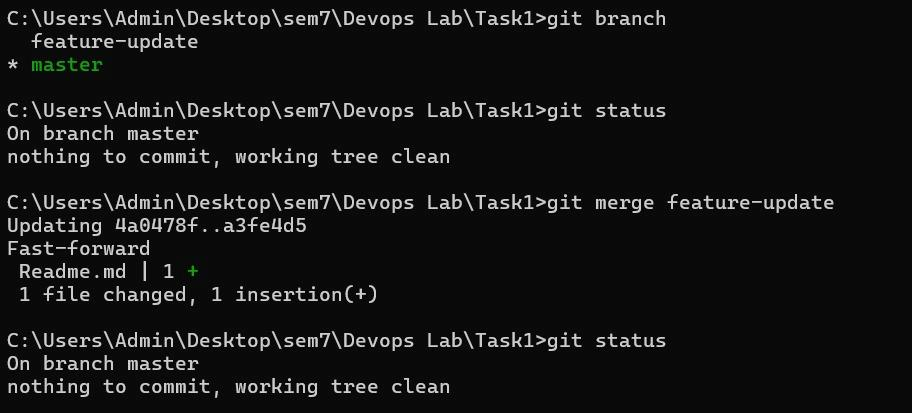
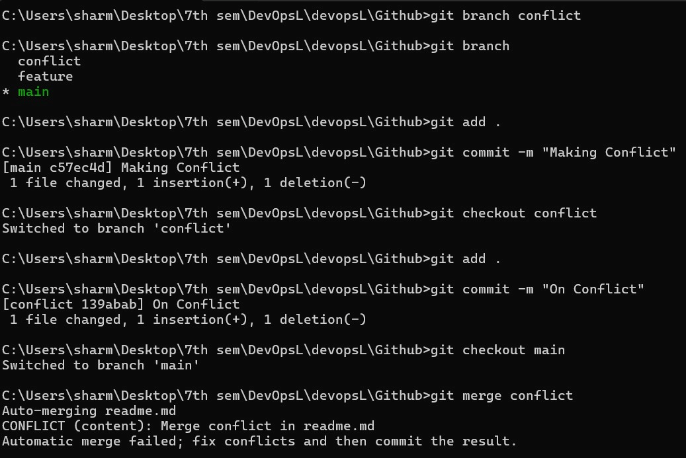

# Assignment TW1.1 – Git Workflow & Collaboration

## Objective
The objective of this assignment is to understand the core concepts of version control using Git, including managing uncommitted changes, staging files, committing revisions, working with feature branches, merging updates, and resolving merge conflicts.

## Tools Used
- **Git**: Command-line version control tool.
- **Git Bash**: Terminal interface for executing Git command lines.
- **GitHub**: Remote repository hosting provider for collaboration.

## Git Commands Used
- `git init` - Initialize a new local Git repository.
- `git status` - Inspect the state of the working directory and staging area.
- `git add <file>` - Add file contents to the staging area.
- `git commit -m "<message>"` - Record changes to the repository history.
- `git branch <branch-name>` - Create a new branch.
- `git checkout <branch-name>` / `git switch <branch-name>` - Switch working directories to the target branch.
- `git merge <branch-name>` - Merge changes from the target branch into the current branch.

## Procedure

### Step 1: Uncommitted Changes
When files are modified or newly created in the repository workspace, they are in an untracked or unstaged state. Running `git status` shows these uncommitted modifications in red, highlighting files that need to be tracked.

### Step 2: Staging Changes
To prepare changes for a commit, files must be moved to the staging area (index) using `git add .` or `git add <filename>`. Running `git status` afterwards confirms that the changes are staged and ready to be committed (displayed in green).

### Step 3: Commit Changes
Staged changes are permanently saved in the local repository history using the `git commit -m "Commit Message"` command. This creates a new commit snapshot with a unique SHA-1 hash.

### Step 4: Create Branch
To work on a feature independently without affecting the main codebase, a new branch is created using `git branch <branch-name>` and selected using `git checkout <branch-name>`.

### Step 5: Commit in Feature Branch
After switching to the new feature branch, updates are made and committed locally. This commit exists only on the feature branch, leaving the master/main branch untouched.

### Step 6: Merge Branches
Once the feature work is complete, we switch back to the main branch (`git checkout main`) and merge the branch updates using the `git merge <branch-name>` command. This integrates the branch history into main.

### Step 7: Merge Conflict
A merge conflict occurs when the same line of the same file is modified differently in two branches, and Git cannot automatically decide which version to keep. During a merge, Git pauses and marks the conflict in the affected files. The engineer must manually resolve the conflict, stage the file, and complete the merge commit.

## Result
Successfully simulated and executed all standard Git workflow tasks: tracking uncommitted changes, staging, committing, branching, merging, and resolving conflicts.

## Conclusion
Git is a vital version control system that enables developers to track changes, work in isolated environments via branching, and resolve collaboration conflicts efficiently.
