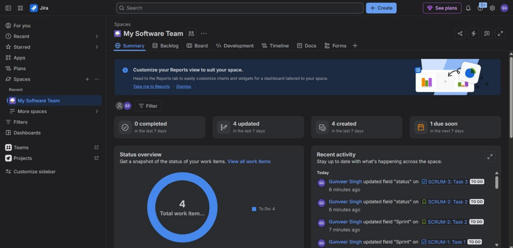
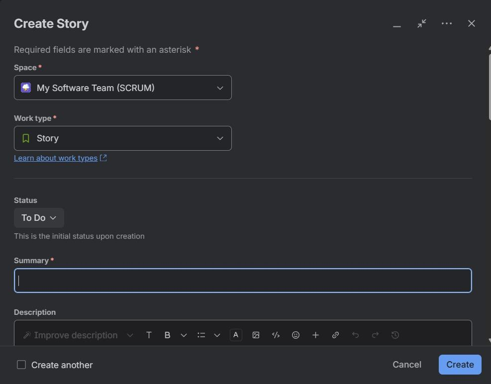
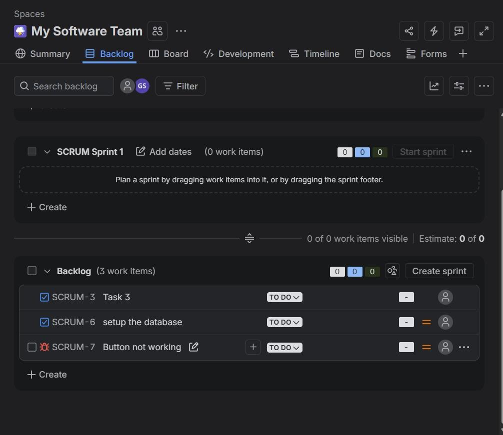

# Assignment TW1.2 – Jira Project & Issue Tracking

## Objective
The objective of this assignment is to learn how to manage software projects using Agile methodologies on the Jira project management platform. This includes setting up a Scrum board, creating and defining user stories, and managing backlog tasks.

## Software Used
- **Jira Software (Atlassian)**: Agile project management and issue tracking system.

## Procedure

### Step 1: Jira Scrum Space
A dedicated Scrum project space is initialized in Jira. This workspace provides an active sprint board, product backlog view, timeline tracking, and reporting features tailored for agile development sprints.

### Step 2: Create Story
User stories are created to represent user-centric feature requirements. Each story includes a description detailing the user perspective, acceptance criteria, story points estimation, epic link, priority, and assignee.

### Step 3: Backlog Tasks
The product backlog acts as a prioritized list of work. Tasks are groomed, prioritized, and moved into the Sprint backlog during sprint planning sessions to define the deliverables for active development.

## Result
Successfully created a Jira Scrum space, defined multiple user stories with Agile criteria, and populated the backlog ready for sprint execution.

## Conclusion
Jira is a powerful Agile management tool that improves team collaboration, prioritizes deliverables through backlogs, and increases project visibility.
