# Project 7: MongoDB and Mongo Express Deployment on Kubernetes

## Project Description

This project demonstrates deploying **MongoDB** and **Mongo Express** on Kubernetes using:

- Deployments
- Services
- ConfigMaps
- Secrets

MongoDB acts as the database, while Mongo Express provides a browser-based administration interface for managing the MongoDB database.

Kubernetes manages container deployment, networking, service discovery, and configuration securely within the cluster.

## Objective

The objective is to:

- Deploy MongoDB on Kubernetes
- Deploy Mongo Express
- Secure credentials using Kubernetes Secrets
- Configure database connection using ConfigMaps
- Expose Mongo Express through a NodePort Service
- Verify successful communication between Mongo Express and MongoDB

## Technologies Used

| Technology | Purpose |
|---|---|
| Kubernetes | Container orchestration |
| Minikube | Local Kubernetes cluster |
| kubectl | Kubernetes command-line tool |
| Docker | Container runtime |
| MongoDB | Database |
| Mongo Express | MongoDB administration interface |
| YAML | Kubernetes configuration |

## Prerequisites

- Docker Desktop
- Minikube
- kubectl
- Kubernetes Cluster
- MongoDB Image
- Mongo Express Image

## Project Structure

```text
Project-7/
│
├── mongodb-secret.yaml
├── mongodb-configmap.yaml
├── mongodb-deployment.yaml
├── mongodb-service.yaml
├── mongo-express-deployment.yaml
├── mongo-express-service.yaml
│
├── screenshots/
│
├── README.md
└── .gitignore
```

| File | Description |
|---|---|
| `mongodb-secret.yaml` | Defines MongoDB credentials using a Kubernetes Secret |
| `mongodb-configmap.yaml` | Stores the MongoDB service configuration |
| `mongodb-deployment.yaml` | Defines the MongoDB Deployment |
| `mongodb-service.yaml` | Provides internal MongoDB networking using ClusterIP |
| `mongo-express-deployment.yaml` | Defines the Mongo Express Deployment and environment variables |
| `mongo-express-service.yaml` | Exposes Mongo Express using NodePort |
| `screenshots/` | Contains screenshots captured during implementation |hh6c
| `README.md` | Project documentation |
| `.gitignore` | Specifies files ignored by Git |

## Kubernetes Architecture

```text
                         User Browser
                              │
                              ▼
                 Mongo Express Service
                       (NodePort)
                              │
                              ▼
                 Mongo Express Deployment
                              │
                              ▼
                    MongoDB Service
                       (ClusterIP)
                              │
                              ▼
                    MongoDB Deployment
                              │
                              ▼
                         MongoDB Pod


                         Secret
                            │
                            ▼
                   MongoDB Credentials


                       ConfigMap
                            │
                            ▼
                   MongoDB Service Name
```

The Secret provides MongoDB credentials, while the ConfigMap provides the MongoDB Service name required for internal communication.

# Implementation Steps

## Step 1: Verify Kubernetes Cluster

The Kubernetes cluster was verified using Minikube and `kubectl` before deploying the application resources.

```bash
minikube status
```

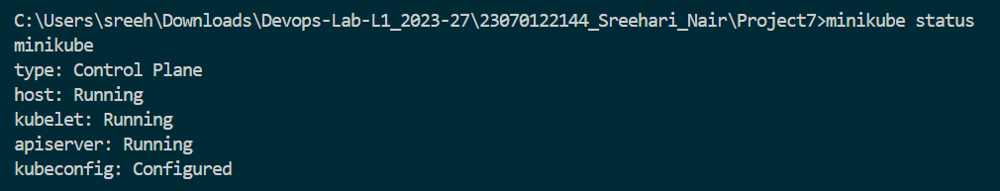

The Minikube cluster is running successfully and is ready for Kubernetes deployments.

```bash
kubectl get all
```

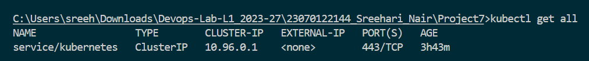

Existing Kubernetes resources were checked before starting the MongoDB and Mongo Express deployment.

## Step 2: Create MongoDB Secret

Kubernetes Secrets are used to store sensitive information such as MongoDB usernames and passwords separately from application configuration.

```yaml
apiVersion: v1
kind: Secret
metadata:
  name: mongodb-secret
type: Opaque
data:
  mongodb-user: YWRtaW4=
  mongodb-password: cGFzc3dvcmQ=
```

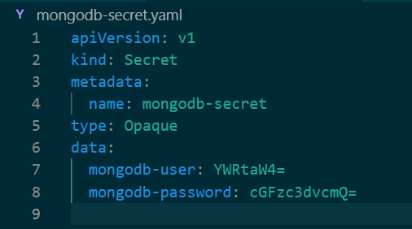

The Secret manifest defines the credentials required for authenticated MongoDB access.

## Step 3: Create ConfigMap

A ConfigMap stores non-sensitive configuration separately from the application deployment. The MongoDB Service name is stored here for service discovery.

```yaml
apiVersion: v1
kind: ConfigMap
metadata:
  name: mongodb-configmap
data:
  database_url: mongodb-service
```

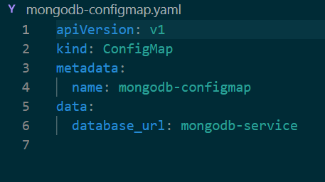

The ConfigMap defines `mongodb-service` as the internal MongoDB endpoint.

## Step 4: Create MongoDB Deployment

A Deployment manages the MongoDB Pod and ensures that the MongoDB container remains available in the Kubernetes cluster.

```yaml
apiVersion: apps/v1
kind: Deployment
metadata:
  name: mongodb-deployment
spec:
  replicas: 1
  selector:
    matchLabels:
      app: mongodb
  template:
    metadata:
      labels:
        app: mongodb
    spec:
      containers:
        - name: mongodb
          image: mongo:latest
          ports:
            - containerPort: 27017
          env:
            - name: MONGO_INITDB_ROOT_USERNAME
              valueFrom:
                secretKeyRef:
                  name: mongodb-secret
                  key: mongodb-user
            - name: MONGO_INITDB_ROOT_PASSWORD
              valueFrom:
                secretKeyRef:
                  name: mongodb-secret
                  key: mongodb-password
```


The MongoDB Deployment creates the database Pod and retrieves its credentials from the Kubernetes Secret.

## Step 5: Create MongoDB Service

A ClusterIP Service provides stable internal networking for MongoDB. Mongo Express can communicate with MongoDB through the Service name instead of using a Pod IP.

```yaml
apiVersion: v1
kind: Service
metadata:
  name: mongodb-service
spec:
  selector:
    app: mongodb
  ports:
    - protocol: TCP
      port: 27017
      targetPort: 27017
  type: ClusterIP
```

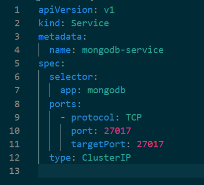

The MongoDB Service exposes port `27017` for internal cluster communication.

## Step 6: Create Mongo Express Deployment

Mongo Express is deployed separately and receives the MongoDB connection details through environment variables.

```yaml
apiVersion: apps/v1
kind: Deployment
metadata:
  name: mongo-express-deployment
spec:
  replicas: 1
  selector:
    matchLabels:
      app: mongo-express
  template:
    metadata:
      labels:
        app: mongo-express
    spec:
      containers:
        - name: mongo-express
          image: mongo-express:latest
          ports:
            - containerPort: 8081
          env:
            - name: ME_CONFIG_MONGODB_ADMINUSERNAME
              valueFrom:
                secretKeyRef:
                  name: mongodb-secret
                  key: mongodb-user
            - name: ME_CONFIG_MONGODB_ADMINPASSWORD
              valueFrom:
                secretKeyRef:
                  name: mongodb-secret
                  key: mongodb-password
            - name: ME_CONFIG_MONGODB_SERVER
              valueFrom:
                configMapKeyRef:
                  name: mongodb-configmap
                  key: database_url
```

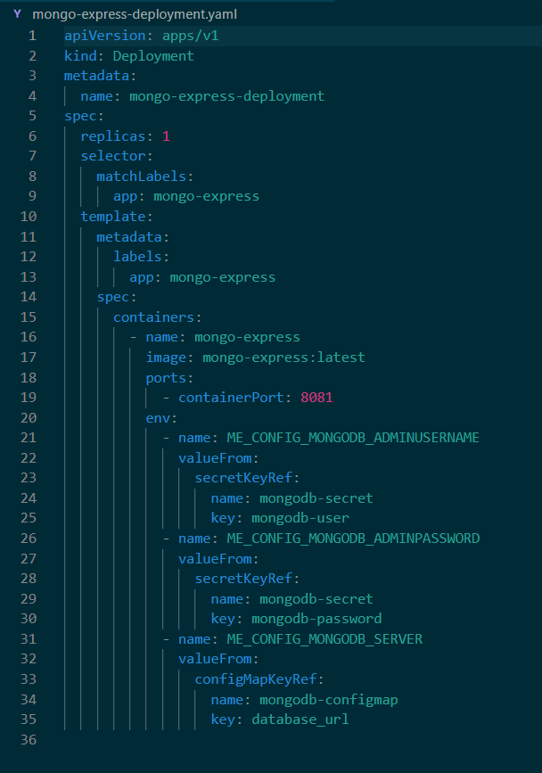

Mongo Express obtains its credentials from the Secret and its MongoDB service name from the ConfigMap.

## Step 7: Create Mongo Express Service

A NodePort Service exposes Mongo Express outside the Kubernetes cluster so that it can be accessed through a web browser.

```yaml
apiVersion: v1
kind: Service
metadata:
  name: mongo-express-service
spec:
  selector:
    app: mongo-express
  ports:
    - protocol: TCP
      port: 8081
      targetPort: 8081
      nodePort: 30000
  type: NodePort
```

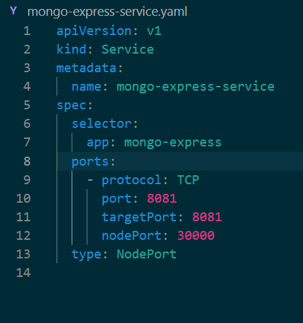

The NodePort Service exposes Mongo Express externally through port `30000`.

## Step 8: Apply Kubernetes Resources

The Kubernetes resource files were applied using `kubectl apply` in the required deployment order.

```bash
kubectl apply -f mongodb-secret.yaml
```

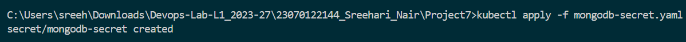

The MongoDB Secret was created successfully.

```bash
kubectl apply -f mongodb-configmap.yaml
```

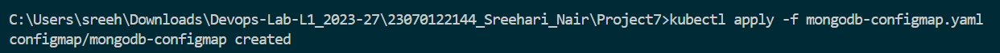

The MongoDB ConfigMap was created successfully.

```bash
kubectl apply -f mongodb-deployment.yaml
```

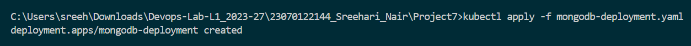

The MongoDB Deployment was created successfully.

```bash
kubectl apply -f mongodb-service.yaml
```

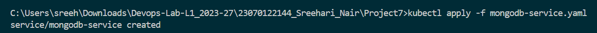

The MongoDB ClusterIP Service was created successfully.

```bash
kubectl apply -f mongo-express-deployment.yaml
```

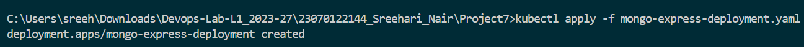

The Mongo Express Deployment was created successfully.

```bash
kubectl apply -f mongo-express-service.yaml
```

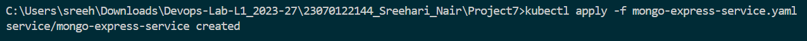

The Mongo Express NodePort Service was created successfully.

## Step 9: Verify Resources

The Kubernetes resources were verified individually to confirm that the deployments, Pods, Services, Secrets, and ConfigMaps were created successfully.

```bash
kubectl get secrets
```

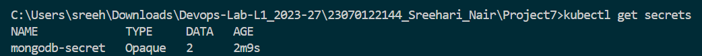

The MongoDB Secret is available in the Kubernetes cluster.

```bash
kubectl get configmaps
```

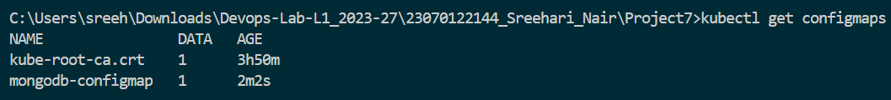

The MongoDB ConfigMap is available for application configuration.

```bash
kubectl get deployments
```

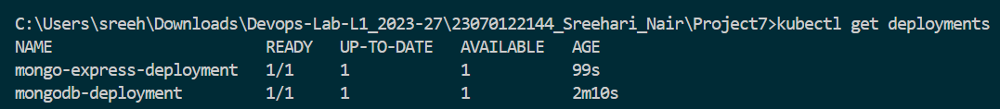

Both MongoDB and Mongo Express Deployments are running successfully.

```bash
kubectl get pods
```

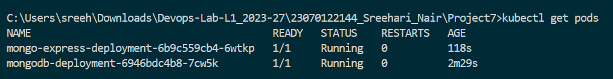

The MongoDB and Mongo Express Pods have reached the running state.

```bash
kubectl get svc
```

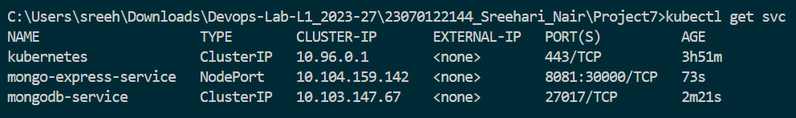

The MongoDB ClusterIP and Mongo Express NodePort Services are available.

```bash
kubectl get all
```

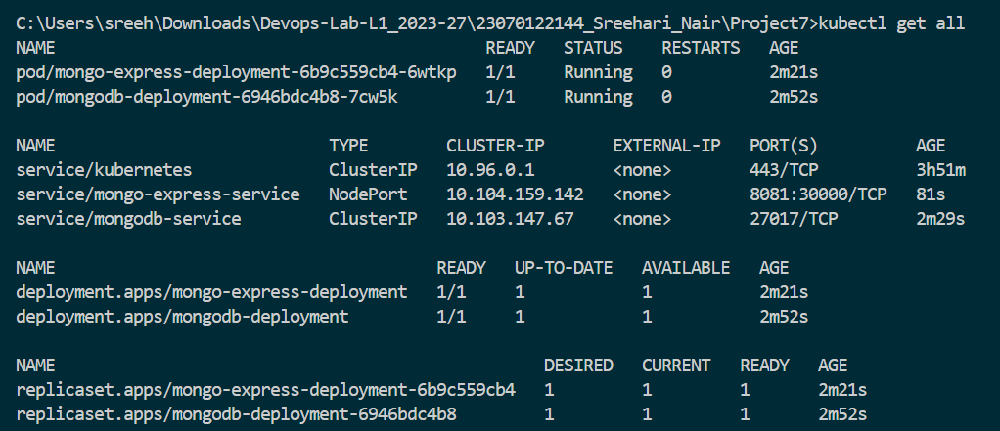

The cluster resource overview confirms that the required application resources are deployed.

## Step 10: Access Mongo Express

Mongo Express was accessed through the Minikube Service command.

```bash
minikube service mongo-express-service
```

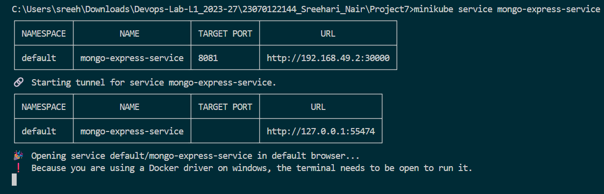

Minikube successfully exposed the Mongo Express NodePort Service for browser access.

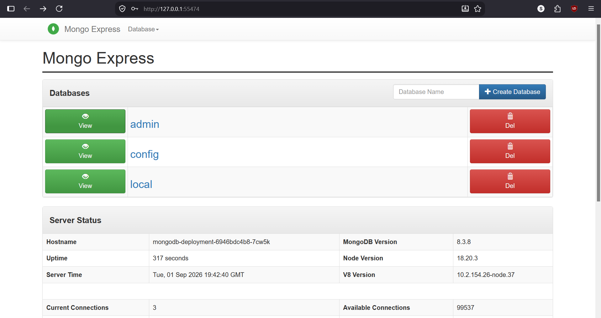

The Mongo Express dashboard loaded successfully, confirming communication with MongoDB.

## Step 11: Verify Mongo Express Logs

The Mongo Express logs were checked to verify application startup and database connectivity.

```bash
kubectl logs deployment/mongo-express-deployment
```

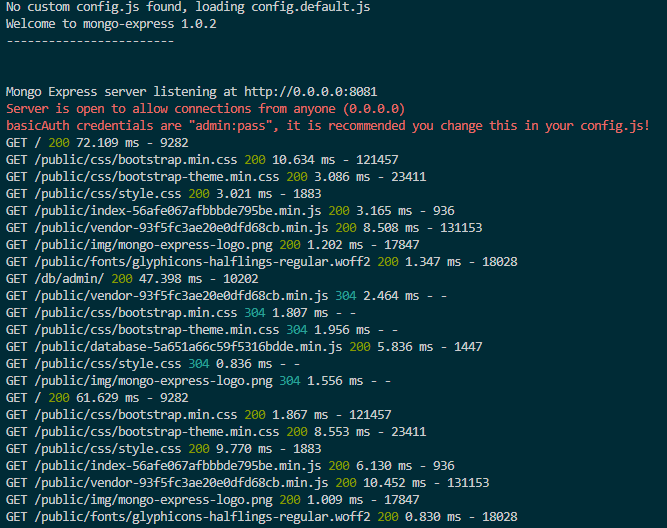

The logs confirm successful Mongo Express operation and database connectivity. Sensitive credentials in the screenshot have been intentionally obscured as a security best practice.

## Step 12: Final Cluster State

The final Kubernetes cluster state was verified using:

```bash
kubectl get all
```

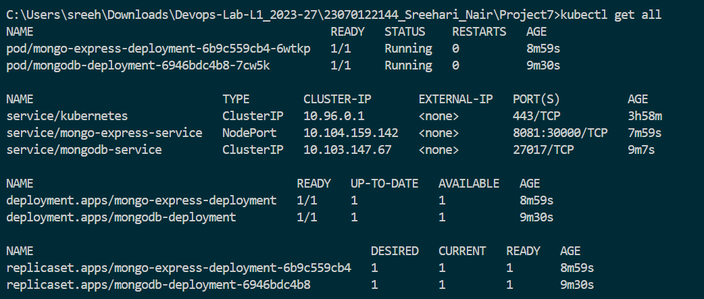

The final state confirms that only MongoDB-related Kubernetes resources remain after cleaning up resources from previous projects.

# Kubernetes Workflow

```text
Secret
  ↓
MongoDB Deployment
  ↓
MongoDB Service
  ↓
ConfigMap
  ↓
Mongo Express Deployment
  ↓
Mongo Express Service (NodePort)
  ↓
Browser Access
```

# Kubernetes Components Used

| Component | Purpose |
|---|---|
| Deployment | Pod Management |
| Service | Networking |
| Secret | Store Credentials |
| ConfigMap | Store Configuration |
| NodePort | External Access |
| ClusterIP | Internal Communication |

# Commands Used

## Cluster Verification

```bash
minikube status
kubectl get all
```

## Resource Creation

```bash
kubectl apply -f mongodb-secret.yaml
kubectl apply -f mongodb-configmap.yaml
kubectl apply -f mongodb-deployment.yaml
kubectl apply -f mongodb-service.yaml
kubectl apply -f mongo-express-deployment.yaml
kubectl apply -f mongo-express-service.yaml
```

## Resource Verification

```bash
kubectl get secrets
kubectl get configmaps
kubectl get deployments
kubectl get pods
kubectl get svc
kubectl get all
```

## Application Access

```bash
minikube service mongo-express-service
kubectl logs deployment/mongo-express-deployment
```

# Build Result

Kubernetes cluster verified successfully.

MongoDB Secret created successfully.

MongoDB ConfigMap created successfully.

MongoDB Deployment created successfully.

MongoDB Service created successfully.

Mongo Express Deployment created successfully.

Mongo Express Service created successfully.

Mongo Express connected successfully to MongoDB.

Application accessible through NodePort.

Final Kubernetes Cluster Status: SUCCESS

# Learning Outcomes

- Deployments
- Services
- Secrets
- ConfigMaps
- NodePort
- ClusterIP
- Pod Management
- MongoDB Deployment
- Mongo Express Deployment
- Kubernetes Networking

# Conclusion

The project successfully demonstrated deploying MongoDB and Mongo Express on Kubernetes using Deployments, Services, ConfigMaps, and Secrets. Secure configuration, service communication, and browser-based database management were successfully implemented and verified.
