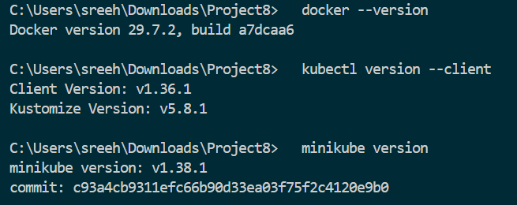
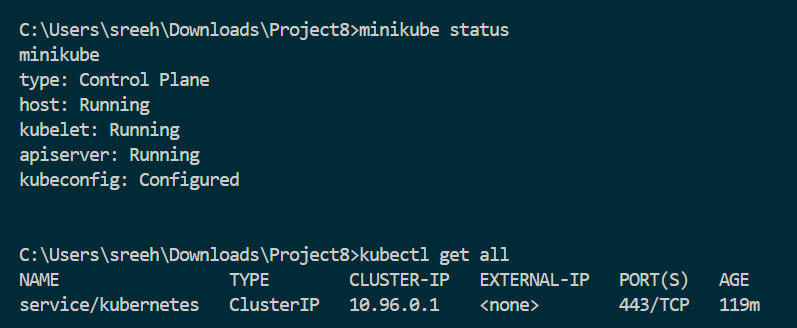
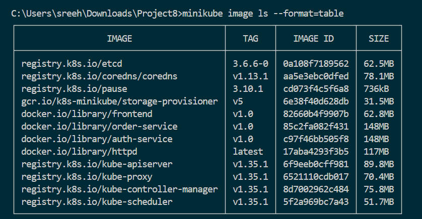
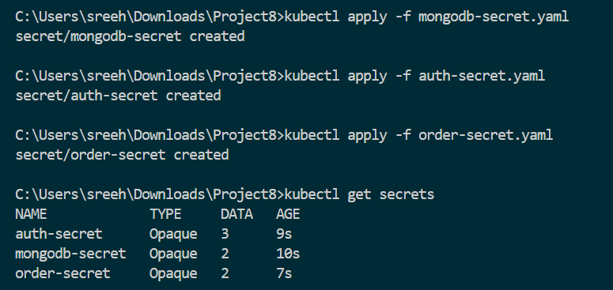
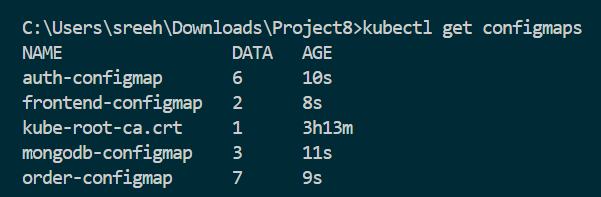
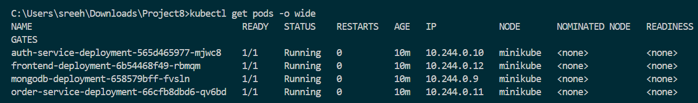
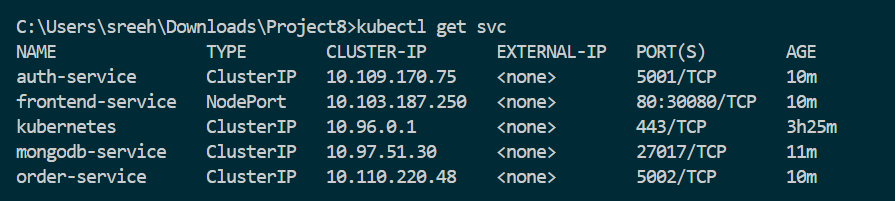
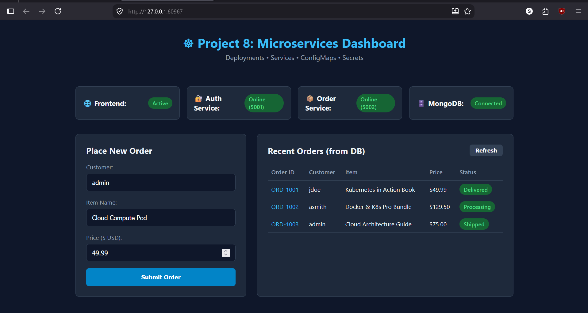
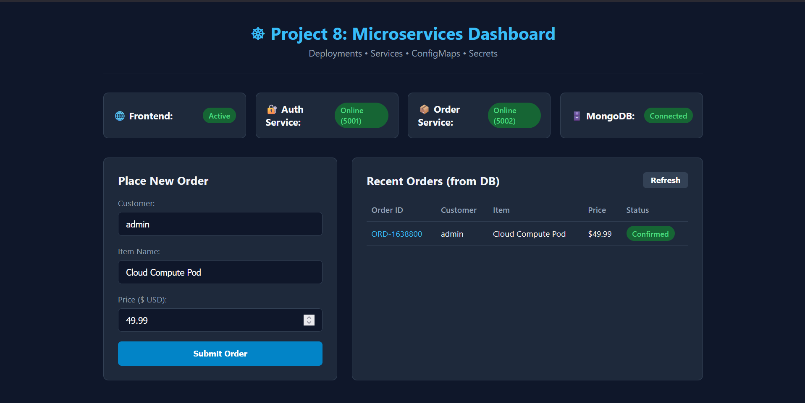
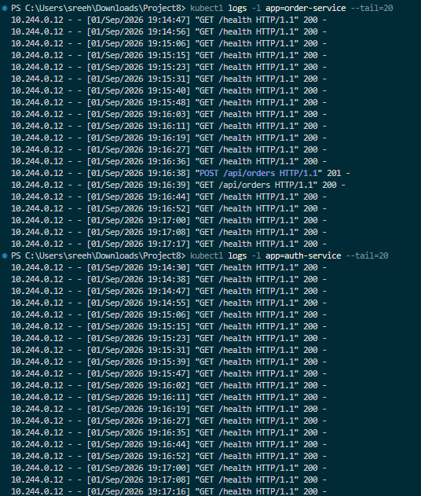

# Project 8: Containerized 4-Tier Microservices Platform on Kubernetes

## Project Description

This project demonstrates the complete containerization and orchestration of a multi-tier microservices platform on **Kubernetes** using:

- **Deployments** (Managing Pod lifecycle, scaling, and rollouts)
- **Services** (`ClusterIP` for secure internal communication and `NodePort` for external user access)
- **ConfigMaps** (Decoupling non-sensitive application environment configurations)
- **Secrets** (Securing sensitive credentials, tokens, and database passwords)

The application architecture consists of **4 distinct microservices**:
1. **Frontend Web Dashboard** (Nginx / Web UI reverse proxy)
2. **Auth Service** (Python / Flask authentication and user management microservice)
3. **Order Service** (Python / Flask orders and catalog management microservice)
4. **Database Service** (MongoDB persistent data store)

Kubernetes handles service discovery, container networking, centralized configuration injection, and automated self-healing across the cluster.

---

## Objectives

- Containerize multiple independent microservices using custom Dockerfiles.
- Deploy a 4-tier microservices architecture on a local Kubernetes cluster (Minikube).
- Isolate and protect sensitive credentials (passwords, JWT keys) using **Kubernetes Secrets**.
- Externalize environment variables and service endpoints using **Kubernetes ConfigMaps**.
- Establish private intra-cluster communication between microservices using **ClusterIP Services**.
- Expose the web frontend to the external host using a **NodePort Service**.
- Validate end-to-end API communication and data persistence across all 4 microservices.

---

## Technologies Used

| Technology | Purpose |
|---|---|
| **Kubernetes** | Container orchestration, self-healing, and service discovery |
| **Minikube** | Local single-node Kubernetes cluster environment |
| **kubectl** | Official command-line interface for Kubernetes |
| **Docker** | Container runtime and multi-stage image builder |
| **Python 3.10 / Flask** | Backend microservices runtime (Auth & Order services) |
| **Nginx (Alpine)** | High-performance reverse proxy and static web server |
| **MongoDB** | NoSQL database storing user and order records |
| **YAML** | Declarative configuration files for Kubernetes manifests |

---

## Prerequisites

- Windows 10/11 with WSL 2 enabled
- Docker Desktop installed and running
- Minikube installed
- kubectl installed
- Web Browser (Edge / Chrome / Firefox)

---

## Project Structure

```text
Project8/
│
├── mongodb-secret.yaml            # Secret: MongoDB root username and password
├── mongodb-configmap.yaml         # ConfigMap: Database name and service DNS
├── mongodb-deployment.yaml        # Deployment: MongoDB database Pod
├── mongodb-service.yaml           # Service: Internal ClusterIP on port 27017
│
├── auth-secret.yaml               # Secret: JWT secret key and admin passwords
├── auth-configmap.yaml            # ConfigMap: Auth service port and DB connections
├── auth-deployment.yaml           # Deployment: Auth service Pod (Python Flask)
├── auth-service.yaml              # Service: Internal ClusterIP on port 5001
│
├── order-secret.yaml              # Secret: API keys and backend credentials
├── order-configmap.yaml           # ConfigMap: Order service port and endpoints
├── order-deployment.yaml          # Deployment: Order service Pod (Python Flask)
├── order-service.yaml             # Service: Internal ClusterIP on port 5002
│
├── frontend-configmap.yaml        # ConfigMap: Web application title and configuration
├── frontend-deployment.yaml       # Deployment: Nginx Web UI dashboard
├── frontend-service.yaml          # Service: External NodePort on port 30080
│
├── services/
│   ├── auth-service/              # Auth microservice source code & Dockerfile
│   │   ├── app.py
│   │   ├── requirements.txt
│   │   └── Dockerfile
│   ├── order-service/             # Order microservice source code & Dockerfile
│   │   ├── app.py
│   │   ├── requirements.txt
│   │   └── Dockerfile
│   └── frontend/                  # Frontend UI dashboard & Nginx reverse proxy
│       ├── index.html
│       ├── style.css
│       ├── app.js
│       ├── nginx.conf
│       └── Dockerfile
│
├── screenshots/                   # Lab verification screenshots
├── README.md                      # Final project documentation & lab report
└── .gitignore
```

---

## Kubernetes Architecture & Inter-Service Networking

```text
                                  User Web Browser
                                         │
                                         ▼ [NodePort :30080]
                         ┌──────────────────────────────┐
                         │   frontend-service (NodePort)│
                         └──────────────┬───────────────┘
                                        │
                                        ▼
                         ┌──────────────────────────────┐
                         │    Frontend Pod (Nginx)      │
                         │  • Reverse Proxy Router      │
                         │  • Injected: frontend-cm     │
                         └──────┬────────────────┬──────┘
                                │                │
               /api/auth/*      │                │   /api/orders/*
       ┌────────────────────────┘                └────────────────────────┐
       ▼                                                                  ▼
┌──────────────────────────────┐                         ┌──────────────────────────────┐
│  auth-service (ClusterIP)    │                         │  order-service (ClusterIP)   │
│  Port: 5001                  │                         │  Port: 5002                  │
└──────────────┬───────────────┘                         └──────────────┬───────────────┘
               │                                                        │
               ▼                                                        ▼
┌──────────────────────────────┐                         ┌──────────────────────────────┐
│       Auth Service Pod       │                         │      Order Service Pod       │
│  • ConfigMap: auth-configmap │                         │  • ConfigMap: order-configmap│
│  • Secret: auth-secret       │                         │  • Secret: order-secret      │
└──────────────┬───────────────┘                         └──────────────┬───────────────┘
               │                                                        │
               │ (Internal Cluster DNS: mongodb-service:27017)           │
               └────────────────────────┬───────────────────────────────┘
                                        │
                                        ▼
                         ┌──────────────────────────────┐
                         │  mongodb-service (ClusterIP) │
                         │  Port: 27017                 │
                         └──────────────┬───────────────┘
                                        │
                                        ▼
                         ┌──────────────────────────────┐
                         │         MongoDB Pod          │
                         │  • ConfigMap: mongodb-cm     │
                         │  • Secret: mongodb-secret    │
                         └──────────────────────────────┘
```

---

# Implementation Steps

## Step 1: Verify Kubernetes Cluster & Prerequisites

Before deploying the microservices, the local environment and Kubernetes cluster status were verified using `kubectl` and `minikube`.

```powershell
docker --version
kubectl version --client
minikube version
```



The Minikube cluster was started with the Docker driver and verified:

```powershell
minikube start --driver=docker
minikube status
```



---

## Step 2: Build Microservice Container Images in Minikube

The container images for the custom microservices (`auth-service`, `order-service`, and `frontend`) were built directly into Minikube's internal Docker registry:

```powershell
minikube image build -t auth-service:v1.0 ./services/auth-service
minikube image build -t order-service:v1.0 ./services/order-service
minikube image build -t frontend:v1.0 ./services/frontend
minikube image ls --format=table
```



---

## Step 3: Create Kubernetes Secrets

Kubernetes Secrets protect sensitive information such as database root credentials, API keys, and JWT authentication tokens:

### 1. `mongodb-secret.yaml`
```yaml
apiVersion: v1
kind: Secret
metadata:
  name: mongodb-secret
type: Opaque
stringData:
  mongo-root-username: admin
  mongo-root-password: secretpassword
```

### 2. `auth-secret.yaml`
```yaml
apiVersion: v1
kind: Secret
metadata:
  name: auth-secret
type: Opaque
stringData:
  jwt-secret: "ecommerce-jwt-super-secret-key-2026"
  admin-password: "admin123"
  db-password: "secretpassword"
```

### 3. `order-secret.yaml`
```yaml
apiVersion: v1
kind: Secret
metadata:
  name: order-secret
type: Opaque
stringData:
  api-secret-key: "ord-sec-key-live-998811"
  db-password: "secretpassword"
```

**Apply Secrets:**
```powershell
kubectl apply -f mongodb-secret.yaml
kubectl apply -f auth-secret.yaml
kubectl apply -f order-secret.yaml
kubectl get secrets
```



---

## Step 4: Create Kubernetes ConfigMaps

ConfigMaps store non-sensitive configuration values such as internal port bindings, database names, and service hostnames.

### 1. `mongodb-configmap.yaml`
```yaml
apiVersion: v1
kind: ConfigMap
metadata:
  name: mongodb-configmap
data:
  database_name: ecommerce_db
  mongodb_service_name: mongodb-service
  mongodb_port: "27017"
```

### 2. `auth-configmap.yaml`
```yaml
apiVersion: v1
kind: ConfigMap
metadata:
  name: auth-configmap
data:
  port: "5001"
  token_expiry: "3600s"
  db_host: "mongodb-service"
  db_port: "27017"
  db_name: "ecommerce_db"
  db_user: "admin"
```

### 3. `order-configmap.yaml`
```yaml
apiVersion: v1
kind: ConfigMap
metadata:
  name: order-configmap
data:
  port: "5002"
  app_env: "production"
  db_host: "mongodb-service"
  db_port: "27017"
  db_name: "ecommerce_db"
  db_user: "admin"
  auth_service_url: "http://auth-service:5001"
```

### 4. `frontend-configmap.yaml`
```yaml
apiVersion: v1
kind: ConfigMap
metadata:
  name: frontend-configmap
data:
  app_title: "Kubernetes 4-Tier Microservices Platform"
  nginx_port: "80"
```

**Apply ConfigMaps:**
```powershell
kubectl apply -f mongodb-configmap.yaml
kubectl apply -f auth-configmap.yaml
kubectl apply -f order-configmap.yaml
kubectl apply -f frontend-configmap.yaml
kubectl get configmaps
```



---

## Step 5: Deploy MongoDB Database Microservice

### `mongodb-deployment.yaml`
```yaml
apiVersion: apps/v1
kind: Deployment
metadata:
  name: mongodb-deployment
  labels:
    app: mongodb
    tier: database
spec:
  replicas: 1
  selector:
    matchLabels:
      app: mongodb
  template:
    metadata:
      labels:
        app: mongodb
        tier: database
    spec:
      containers:
        - name: mongodb
          image: mongo:6.0
          imagePullPolicy: IfNotPresent
          ports:
            - containerPort: 27017
          env:
            - name: MONGO_INITDB_ROOT_USERNAME
              valueFrom:
                secretKeyRef:
                  name: mongodb-secret
                  key: mongo-root-username
            - name: MONGO_INITDB_ROOT_PASSWORD
              valueFrom:
                secretKeyRef:
                  name: mongodb-secret
                  key: mongo-root-password
            - name: MONGO_INITDB_DATABASE
              valueFrom:
                configMapKeyRef:
                  name: mongodb-configmap
                  key: database_name
```

### `mongodb-service.yaml`
```yaml
apiVersion: v1
kind: Service
metadata:
  name: mongodb-service
spec:
  type: ClusterIP
  selector:
    app: mongodb
  ports:
    - protocol: TCP
      port: 27017
      targetPort: 27017
```

**Apply MongoDB Resources:**
```powershell
kubectl apply -f mongodb-deployment.yaml
kubectl apply -f mongodb-service.yaml
```

---

## Step 6: Deploy Auth Microservice

### `auth-deployment.yaml`
```yaml
apiVersion: apps/v1
kind: Deployment
metadata:
  name: auth-service-deployment
  labels:
    app: auth-service
spec:
  replicas: 1
  selector:
    matchLabels:
      app: auth-service
  template:
    metadata:
      labels:
        app: auth-service
    spec:
      containers:
        - name: auth-service
          image: auth-service:v1.0
          imagePullPolicy: IfNotPresent
          ports:
            - containerPort: 5001
          env:
            - name: PORT
              valueFrom:
                configMapKeyRef:
                  name: auth-configmap
                  key: port
            - name: DB_HOST
              valueFrom:
                configMapKeyRef:
                  name: auth-configmap
                  key: db_host
            - name: DB_PASS
              valueFrom:
                secretKeyRef:
                  name: auth-secret
                  key: db-password
            - name: JWT_SECRET
              valueFrom:
                secretKeyRef:
                  name: auth-secret
                  key: jwt-secret
```

### `auth-service.yaml`
```yaml
apiVersion: v1
kind: Service
metadata:
  name: auth-service
spec:
  type: ClusterIP
  selector:
    app: auth-service
  ports:
    - protocol: TCP
      port: 5001
      targetPort: 5001
```

**Apply Auth Resources:**
```powershell
kubectl apply -f auth-deployment.yaml
kubectl apply -f auth-service.yaml
```

---

## Step 7: Deploy Order Microservice

### `order-deployment.yaml`
```yaml
apiVersion: apps/v1
kind: Deployment
metadata:
  name: order-service-deployment
  labels:
    app: order-service
spec:
  replicas: 1
  selector:
    matchLabels:
      app: order-service
  template:
    metadata:
      labels:
        app: order-service
    spec:
      containers:
        - name: order-service
          image: order-service:v1.0
          imagePullPolicy: IfNotPresent
          ports:
            - containerPort: 5002
          env:
            - name: PORT
              valueFrom:
                configMapKeyRef:
                  name: order-configmap
                  key: port
            - name: DB_HOST
              valueFrom:
                configMapKeyRef:
                  name: order-configmap
                  key: db_host
            - name: DB_PASS
              valueFrom:
                secretKeyRef:
                  name: order-secret
                  key: db-password
            - name: API_SECRET_KEY
              valueFrom:
                secretKeyRef:
                  name: order-secret
                  key: api-secret-key
```

### `order-service.yaml`
```yaml
apiVersion: v1
kind: Service
metadata:
  name: order-service
spec:
  type: ClusterIP
  selector:
    app: order-service
  ports:
    - protocol: TCP
      port: 5002
      targetPort: 5002
```

**Apply Order Resources:**
```powershell
kubectl apply -f order-deployment.yaml
kubectl apply -f order-service.yaml
```

---

## Step 8: Deploy Frontend Microservice

### `frontend-deployment.yaml`
```yaml
apiVersion: apps/v1
kind: Deployment
metadata:
  name: frontend-deployment
  labels:
    app: frontend
spec:
  replicas: 1
  selector:
    matchLabels:
      app: frontend
  template:
    metadata:
      labels:
        app: frontend
    spec:
      containers:
        - name: frontend
          image: frontend:v1.0
          imagePullPolicy: IfNotPresent
          ports:
            - containerPort: 80
```

### `frontend-service.yaml`
```yaml
apiVersion: v1
kind: Service
metadata:
  name: frontend-service
spec:
  type: NodePort
  selector:
    app: frontend
  ports:
    - protocol: TCP
      port: 80
      targetPort: 80
      nodePort: 30080
```

**Apply Frontend Resources:**
```powershell
kubectl apply -f frontend-deployment.yaml
kubectl apply -f frontend-service.yaml
```

---

## Step 9: Verify All Cluster Resources

All 4 microservice pods, deployments, and services were verified across the Kubernetes cluster:

```powershell
kubectl get pods -o wide
```



```powershell
kubectl get svc
```



---

## Step 10: Application Testing & Browser Verification

The application dashboard was accessed through the Minikube service URL:

```powershell
minikube service frontend-service
```



An order was created using the web UI form. The Frontend reverse-proxied the request to `order-service:5002`, which inserted the record into `mongodb-service:27017` and updated the real-time orders record:



---

## Step 11: Pod Logs and Network Routing Verification

Pod logs were inspected using `kubectl logs` to confirm inter-service communication:

```powershell
kubectl logs -l app=order-service --tail=20
```



---

## Key Kubernetes Concepts Demonstrated

1. **Deployments**: Ensured declarative pod creation, automated pod restarts upon failure, and zero-downtime rolling updates.
2. **Services (`ClusterIP`)**: Provided stable DNS names (`auth-service`, `order-service`, `mongodb-service`) and internal load balancing without exposing internal microservices to the public internet.
3. **Services (`NodePort`)**: Exposed the Frontend UI dashboard to the host machine through port `30080`.
4. **ConfigMaps**: Allowed dynamic injection of non-sensitive parameters (endpoints, database names, ports) without rebuilding Docker images.
5. **Secrets**: Kept sensitive passwords, JWT signing keys, and API tokens securely encrypted and isolated from application source code.
6. **Reverse Proxy Routing**: Configured Nginx to proxy API requests internally across Kubernetes cluster DNS names, avoiding browser CORS constraints.

---

## Conclusion

In this project, a complete 4-tier microservices architecture (**Frontend UI**, **Auth Service**, **Order Service**, and **MongoDB Database**) was successfully containerized, configured, and deployed onto a Kubernetes cluster. 

The deployment successfully met all objectives:
- Separation of configuration using **ConfigMaps** and **Secrets**.
- Reliable inter-service communication through **ClusterIP Services**.
- External accessibility via **NodePort**.
- Verified data flow and persistence across all four microservices.
