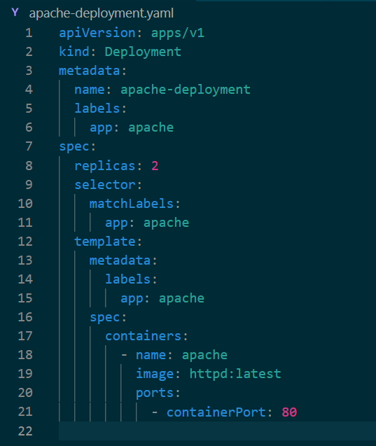
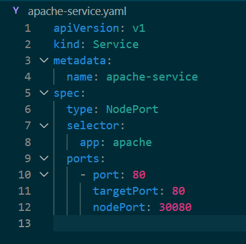
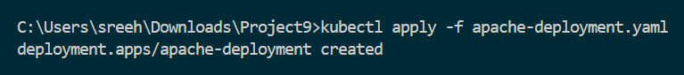
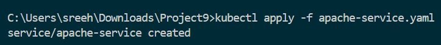
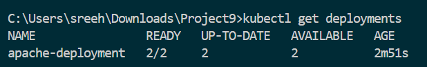
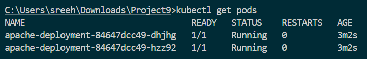
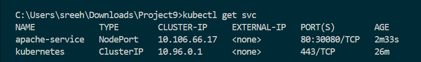
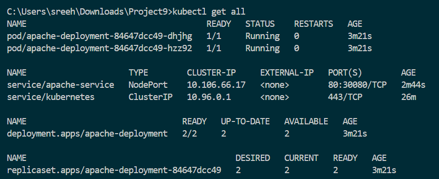
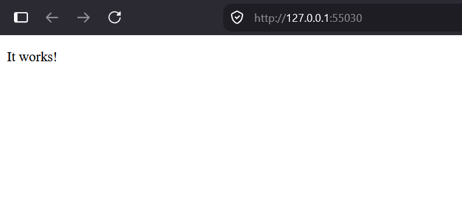
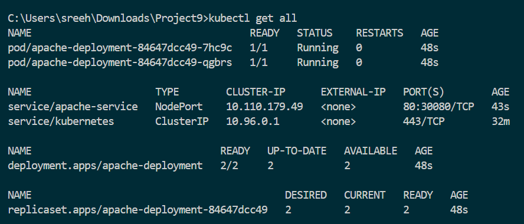

# Project 9: Apache Web Server Deployment on Kubernetes

**Student Name:** Sreehari Nair
**PRN:** 23070122144 

---

## Project Description

This project demonstrates the deployment of an Apache HTTP Web Server on Kubernetes using a Deployment resource and exposing it externally through a NodePort Service. Kubernetes manages container deployment, lifecycle, self-healing, and networking, while Apache serves web content to the host machine.

---

## Objective

- Deploy Apache HTTP Server using a Kubernetes Deployment resource.
- Expose the containerized application through a NodePort Service.
- Verify pod creation, health, and service availability using `kubectl` commands.
- Access the Apache web page from the host machine browser.
- Understand the role of Deployments, ReplicaSets, Pods, and Services in Kubernetes.

---

## Technologies Used

| Technology | Purpose |
|---|---|
| **Kubernetes** | Container orchestration platform |
| **Minikube** | Local single-node Kubernetes cluster |
| **kubectl** | Kubernetes command-line management tool |
| **Docker** | Containerization runtime |
| **Apache HTTP Server (`httpd`)** | Web server application |
| **YAML** | Resource configuration file format |

---

## Prerequisites

- Docker Desktop (running)
- Minikube
- kubectl CLI
- Local Kubernetes Cluster running (`minikube start`)
- Official Apache HTTP Server Docker image (`httpd:latest`)

---

## Project Structure

```
Project9/
│
├── apache-deployment.yaml     # Kubernetes Deployment manifest for Apache
├── apache-service.yaml        # NodePort Service manifest to expose Apache
├── README.md                  # Project submission report
│
└── screenshots/               # Captured verification screenshots
    ├── 01_apache_deployment_yaml.png
    ├── 02_apache_service_yaml.png
    ├── 03_deployment_apply_success.png
    ├── 04_service_apply_success.png
    ├── 05_deployments_running.png
    ├── 06_pods_running.png
    ├── 07_service_running.png
    ├── 08_cluster_resources.png
    ├── 09_apache_homepage_1.png
    └── 10_final_cluster_state.png
```

---

## Kubernetes Architecture

```
Host Browser
     │
     ▼
Apache Service (NodePort: 30080 / Port: 80)
     │
     ▼
Apache Deployment (ReplicaSet)
     │
     ├──► Apache Pod 1 (Container Port: 80)
     └──► Apache Pod 2 (Container Port: 80)
```

---

## Implementation

### Step 1: Create Apache Deployment

A Kubernetes Deployment was created to manage the Apache HTTP Server pods, ensuring that two replicas are continuously maintained and automatically restored if any pod fails.

```yaml
apiVersion: apps/v1
kind: Deployment
metadata:
  name: apache-deployment
  labels:
    app: apache
spec:
  replicas: 2
  selector:
    matchLabels:
      app: apache
  template:
    metadata:
      labels:
        app: apache
    spec:
      containers:
        - name: apache
          image: httpd:latest
          ports:
            - containerPort: 80
```


*Figure 1: The Deployment YAML file defining replica count, container image, and port configuration.*

---

### Step 2: Create Apache Service

A `NodePort` Service was configured to expose the pods managed by `apache-deployment` outside the cluster, enabling access from the host machine.

```yaml
apiVersion: v1
kind: Service
metadata:
  name: apache-service
spec:
  type: NodePort
  selector:
    app: apache
  ports:
    - port: 80
      targetPort: 80
      nodePort: 30080
```


*Figure 2: The Service YAML file configuring NodePort to route traffic to the Apache deployment.*

---

### Step 3: Deploy Resources

The Deployment and Service manifests were applied to the local Kubernetes cluster:

```bash
kubectl apply -f apache-deployment.yaml
kubectl apply -f apache-service.yaml
```


*Figure 3: Confirmation showing the Apache Deployment created in the cluster.*


*Figure 4: Confirmation showing the Apache Service created in the cluster.*

---

### Step 4: Verify Kubernetes Resources

The status of the Deployment, Pods, and Service were verified to ensure proper initialization:

```bash
kubectl get deployments
kubectl get pods
kubectl get svc
kubectl get all
```


*Figure 5: Output showing the Apache Deployment with 2/2 ready replicas.*


*Figure 6: Output confirming both Apache pods in Running status.*


*Figure 7: Output showing the Apache Service running with assigned NodePort.*


*Figure 8: Overview listing all active Kubernetes resources related to the Apache deployment.*

---

### Step 5: Access Apache Web Server from Host Machine

The Apache web server was accessed from the host machine browser using Minikube's service bridge:

```bash
minikube service apache-service
```
*(or alternatively using URL query: `minikube service apache-service --url`)*

The default Apache HTTP Server welcome page (**"It works!"**) loaded successfully, verifying end-to-end network connectivity from host to container.


*Figure 9: Apache HTTP Server default welcome page accessed in host browser.*

---

### Step 6: Final Cluster State

A final check of the cluster state confirms that all resources are active and healthy:

```bash
kubectl get all
```


*Figure 10: Final cluster state displaying the active Deployment, ReplicaSet, Pods, and Service.*

---

## Kubernetes Components Summary

| Component | Purpose |
|---|---|
| **Deployment** | Manages declarative updates and lifecycle for Apache pods |
| **ReplicaSet** | Ensures the defined number of identical pod replicas (2) are running |
| **Pod** | The smallest deployable unit hosting the Apache `httpd` container |
| **Service (NodePort)** | Exposes the application externally by allocating a static port across cluster nodes |

---

## Commands Summary

### Deployment Commands
```bash
kubectl apply -f apache-deployment.yaml
kubectl apply -f apache-service.yaml
```

### Verification Commands
```bash
kubectl get deployments
kubectl get pods
kubectl get svc
kubectl get all
```

### Host Access Commands
```bash
minikube service apache-service
# Or alternatively:
minikube service apache-service --url
# Or port-forwarding:
kubectl port-forward svc/apache-service 8080:80
```

---

## Lab Results

- **Apache Deployment:** Created and verified (`2/2` Ready)
- **Apache Service:** Created and exposed (`NodePort: 30080`)
- **Pods Status:** Both replicas in `Running` state
- **Host Connectivity:** Successfully accessed Apache web page from host machine browser
- **Overall Status:** SUCCESS

---

## Learning Outcomes

1. Gained hands-on experience writing Kubernetes Deployment and Service YAML manifests.
2. Understood how Kubernetes Deployments manage pod replicas and automatic recovery.
3. Learned how `NodePort` Services expose internal cluster workloads to the host network.
4. Practiced cluster inspection and debugging using `kubectl` commands.
5. Successfully connected to containerized services from the host machine using Minikube.

---

## Conclusion

This lab successfully demonstrated deploying the Apache2 web server on Kubernetes and accessing it from the host machine. By combining a Deployment for replica management with a NodePort Service for external networking, the web application was made available to the host browser, fulfilling all lab objectives.
